<!-- markdownlint-disable MD060 -->

# Library Scanner — Reference

The library scanner is the pipeline that turns a directory of CBZ
archives into the Folio database. It runs as an apalis background job,
streams real-time progress over a WebSocket, and is idempotent — running
the same scan twice produces the same DB state. This document is a
developer reference: it covers the architecture, the per-phase
walkthrough, what changes on a re-scan, every fast-path the scanner
uses to avoid redundant work, every health issue it can raise, every
event the live-scan UI consumes, and the operator surface.

Companion specs and wider context:

- [`comic-reader-spec.md`](../../comic-reader-spec.md) — overall product
  spec; the scanner is §4 (lifecycle), §6 (parsing), §7 (identity), §10
  (health issues), §14 (operations).
- [`docs/dev/phase-status.md`](phase-status.md) — what shipped when.

## End-to-end flow

```mermaid
flowchart TD
    classDef trig fill:#e3f2fd,stroke:#1565c0
    classDef phase fill:#f3e5f5,stroke:#6a1b9a
    classDef ingest fill:#fff3e0,stroke:#e65100
    classDef recon fill:#e8f5e9,stroke:#2e7d32
    classDef event fill:#fce4ec,stroke:#ad1457

    %% Triggers
    UI["Admin UI<br/><b>POST /libraries/:slug/scan</b>"]:::trig
    SR["UI<br/><b>POST /series/:id/scan</b>"]:::trig
    IR["UI<br/><b>POST /issues/:id/scan</b>"]:::trig
    FW["File-watch<br/><i>notify, 30s debounce</i>"]:::trig
    SCH["Scheduler<br/><i>scan_schedule_cron</i>"]:::trig
    BOOT["Boot<br/><i>COMIC_SCAN_ON_STARTUP</i>"]:::trig

    UI --> COAL["jobs::JobRuntime::coalesce_scan<br/><i>in-flight gate per library</i>"]
    SCH --> COAL
    BOOT --> COAL
    SR --> SS["jobs/scan_series.rs<br/><b>JobKind::Series</b>"]
    IR --> SS2["jobs/scan_series.rs<br/><b>JobKind::Issue</b>"]
    FW --> SS

    COAL --> SCAN["jobs/scan.rs::handle"]
    SS --> NARROW["scan_series_folder<br/>scanner/mod.rs:295"]:::phase
    SS2 --> ISCAN["scan_issue_file<br/>scanner/mod.rs:376"]:::phase
    SCAN --> SLIB["scan_library_with_run_id<br/>scanner/mod.rs:57"]:::phase

    SLIB --> VAL["Phase 1 · validate<br/>scanner/validate.rs:34"]:::phase
    NARROW --> ENUM
    ISCAN --> RIP["run_issue_phase<br/>scanner/mod.rs:934"]:::phase
    VAL --> OPEN["open_scan_run · scan_runs row created<br/>emit ScanEvent::Started"]:::event
    OPEN --> ENUM["Phase 2 · enumerate<br/>scanner/enumerate.rs:33<br/>raises FileAtRoot / EmptyFolder"]:::phase
    ENUM --> PLAN["Phase 3 · plan<br/>build_library_scan_plan<br/>scanner/mod.rs:694"]:::phase

    PLAN --> CHK{"force=true?"}
    CHK --> KSF["known_series_by_folder<br/>scanner/mod.rs:664"]
    KSF -- "force=yes" --> SKIP["skip mtime check<br/>list every archive"]
    KSF --> WALK{"folder mtime ><br/>last_scanned_at?"}
    WALK -- "no" --> MARKSKIP["mark folder skipped_unchanged<br/>health.touch_folder"]
    WALK -- "yes" --> WALKED["list_archives_changed_since<br/>scanner/enumerate.rs:123"]
    SKIP --> FAN
    WALKED --> FAN
    MARKSKIP --> FAN

    FAN["fan-out · scan_worker_count tasks<br/>process_planned_folder<br/>scanner/mod.rs:1423"]:::phase
    FAN --> IDH["peek_identity_hint<br/>read_series_json<br/>resolve_or_create<br/>library/identity.rs:86"]:::ingest
    IDH --> SUEV["emit ScanEvent::SeriesUpdated<br/>≤10/sec throttle"]:::event
    SUEV --> ING["per-archive ingest loop<br/>ingest_one_with_fingerprint<br/>scanner/process.rs:129"]:::ingest
    ING --> FFP{"size+mtime match<br/>& not force?"}
    FFP -- "yes" --> SKIP2["files_unchanged++<br/>health.touch_file"]
    FFP -- "no" --> HASH["BLAKE3 + parse_archive<br/>(blocking, semaphore)"]
    HASH --> DEDUP{"hash matches<br/>existing issue?"}
    DEDUP -- "old path missing" --> MOVE["update issue path<br/>record issue_paths alias"]
    DEDUP -- "old path exists" --> DUPE["emit DuplicateContent<br/>files_duplicate++ skip"]
    DEDUP -- "no" --> UPSERT["upsert issue row<br/>replace metadata junctions<br/>enqueue cover thumb"]
    UPSERT --> PROG["emit ScanEvent::Progress<br/>(per-batch · 750ms heartbeat)"]:::event

    PROG --> RECON
    SKIP2 --> RECON
    DUPE --> RECON
    DUPE -.-> HE["emit ScanEvent::HealthIssue"]:::event

    RECON["Phase 4 · reconcile<br/>reconcile_library_seen<br/>library/reconcile.rs:99"]:::recon
    RECON --> TOMB["soft-delete missing issues · restore returning ones · series tombstone if empty"]:::recon
    TOMB --> RST["reconcile_series_status_many<br/>scanner/reconcile_status.rs:66"]:::recon
    RST --> POST["Phase 5 · post-scan enqueue<br/>scanner/mod.rs:1336"]:::phase
    POST --> THUMBS["enqueue_post_scan_for_library<br/>jobs/post_scan.rs:440 (missing/stale covers only)"]
    THUMBS -.-> TS["emit thumbs.started/completed/failed"]:::event
    POST --> FIN["finalize_run · scan_runs.state=complete<br/>emit ScanEvent::Completed"]:::event
```

The diagram shows the library-scan path. The series and issue paths
short-circuit through `scan_series_folder` (mod.rs:295) and
`scan_issue_file` (mod.rs:376) respectively — they reuse the same
ingest pipeline but skip enumerate/plan and run a series-scoped
reconcile so unscanned siblings stay untouched.

## Triggers

| Trigger | Endpoint / source | Notes |
|---|---|---|
| Manual library scan | `POST /libraries/{slug}/scan` ([api/libraries.rs:480](../../crates/server/src/api/libraries.rs#L480)) | 202 + `{ scan_id, state, coalesced, mode, coalesced_into, queued_followup, reason }`. `mode=normal | metadata_refresh | content_verify`; `?force=true` remains a content-verify alias. Coalesces on an existing in-flight scan. |
| Manual series scan | `POST /series/{id}/scan` | Per-folder rescan via [`jobs/scan_series.rs`](../../crates/server/src/jobs/scan_series.rs) with `JobKind::Series`. Manual clicks set `force=true`. |
| Manual issue scan | `POST /issues/{id}/scan` | Same job type, `JobKind::Issue` — runs [`scan_issue_file`](../../crates/server/src/library/scanner/mod.rs#L376). |
| Scheduled scan | `library.scan_schedule_cron` per-library | [`jobs/scheduler.rs:224`](../../crates/server/src/jobs/scheduler.rs#L224) — `coalesce_scan(.., false)`. 5- or 6-field cron via `tokio_cron_scheduler`. |
| File-watch | `notify-debouncer-full` (30 s window) | Per-library, only when `library.file_watch_enabled=true`. Enqueues `scan_series` jobs with `force=false`. |
| Startup scan | `COMIC_SCAN_ON_STARTUP=true` | Enqueues a full scan of every library at boot. |

## Phase walkthrough

The library path (`scan_library_with_run_id` at
[mod.rs:57](../../crates/server/src/library/scanner/mod.rs#L57)) runs
five phases. Series and issue paths reuse phases 3–5 in a narrowed form.

### 4.1 Validate

- **Where**: [`scanner/validate.rs:34`](../../crates/server/src/library/scanner/validate.rs#L34)
- **Inputs**: the `library` row (path, id).
- **Checks** (fatal — `scan_runs.state='failed'` if any fails):
  - root path canonicalizes (else `RootMissing`)
  - is a directory
  - is readable and non-empty
  - is not equal to `COMIC_DATA_PATH` (`LoopWithDataPath`)
  - does not equal or contain another library's root
    (`OverlapsAnotherLibrary`)
- **Output**: `Result<(), ValidationError>`. The narrow series path uses
  the lighter [`folder_still_exists`](../../crates/server/src/library/scanner/validate.rs#L79)
  check instead.

### 4.2 Enumerate

- **Where**: [`scanner/enumerate.rs:33`](../../crates/server/src/library/scanner/enumerate.rs#L33)
  (called from [mod.rs:1130](../../crates/server/src/library/scanner/mod.rs#L1130) on a
  blocking thread).
- **Inputs**: library root + compiled `IgnoreRules`.
- **Outputs**: `EnumerationResult { series_folders, files_at_root,
  empty_folders }`.
- **Layout rules** (spec §2.2, §5.1):
  - dot-prefixed entries (`.git`, `.DS_Store`, …) are silently skipped
  - built-in skips: `__MACOSX`, `Thumbs.db`, `desktop.ini`, `@eaDir`
  - user-glob ignores apply before classification
  - files at root → `FileAtRoot` health issue
    ([mod.rs:1138](../../crates/server/src/library/scanner/mod.rs#L1138))
  - dirs with no entries → `EmptyFolder` health issue
    ([mod.rs:1141](../../crates/server/src/library/scanner/mod.rs#L1141))
  - non-empty dirs → series-folder candidates

### 4.3 Plan

- **Where**: [`build_library_scan_plan`](../../crates/server/src/library/scanner/mod.rs#L694).
- **What**: for each series-folder candidate, decide whether to walk it
  this scan, and if so list every recognized archive inside.
- **Fast-path branch** ([mod.rs:707–744](../../crates/server/src/library/scanner/mod.rs#L707-L744)):
  when `force=false` and the series row carries a `last_scanned_at`,
  call [`list_archives_changed_since`](../../crates/server/src/library/scanner/enumerate.rs#L123)
  — if the recursive max mtime ≤ `last_scanned_at`, the folder is
  marked `skipped_unchanged=true` and its archives are still listed
  (the walker collects them while looking at mtimes) but the folder
  short-circuits during processing.
- **Force branch**: keep the known-series cache active, but bypass the
  folder mtime skip and list archives in every folder.
- **Concurrency**: planning is parallelized at `scan_worker_count`
  via `buffer_unordered`.

### 4.4 Process folder (parallel)

- **Where**: [`process_planned_folder`](../../crates/server/src/library/scanner/mod.rs#L1423),
  fanned out from [mod.rs:1185](../../crates/server/src/library/scanner/mod.rs#L1185)
  with `buffer_unordered(scan_worker_count)`.
- **Inputs**: a `PlannedFolder { path, archives, known_series_id,
  skipped_unchanged }`.
- **Steps** in order:

  1. **Skip-unchanged short-circuit**
     ([mod.rs:1439–1452](../../crates/server/src/library/scanner/mod.rs#L1439-L1452)).
     Folder is `skipped_unchanged` → bump `series_skipped_unchanged`,
     call `health.touch_folder` so the auto-resolve sweep does not
     close issues whose root cause is still on disk, return
     `processed=false`.
  2. **Series identity** ([mod.rs:1470–1520](../../crates/server/src/library/scanner/mod.rs#L1470-L1520)).
     Build a `SeriesIdentityHint` by merging:
     - `process::peek_identity_hint(&archives[0])` — first archive's
       ComicInfo
     - `process::read_series_json(&folder)` — Mylar3 sidecar
       (gap-fills name, year, publisher, imprint, age_rating,
       total_issues, volume, comicvine_id; ComicInfo wins on
       overlapping fields per spec §6.7)

     Then call [`identity::resolve_or_create`](../../crates/server/src/library/identity.rs#L86):
     1. sticky `match_key` (admin override) — never overwritten
     2. `folder_path` exact match — fast path, just reuse the row
     3. normalized `name + year` — picks up renamed folders;
        backfills `folder_path` so the next scan takes the fast path
     4. otherwise create a new series row stamped with `folder_path`

     Then emit [`ScanEvent::SeriesUpdated`](../../crates/server/src/library/scanner/mod.rs#L1522)
     (≤10/sec/library throttle; see §Progress events).
  3. **Per-archive ingest loop**
     ([mod.rs:1535–1616](../../crates/server/src/library/scanner/mod.rs#L1535-L1616)).
     Build a path → row manifest, then for each archive:
     - `file_fingerprint` (size + mtime) →
     - if not `force` and the existing row's metadata is current →
       `files_unchanged++`, `health.touch_file`, skip;
     - else add to `candidates`.

     Process candidates in chunks of `scan_batch_size` per transaction
     ([mod.rs:1564–1616](../../crates/server/src/library/scanner/mod.rs#L1564-L1616)):
     a single ingest failure rolls back that batch only, the next
     batch still commits. Per-archive ingest is
     [`ingest_one_with_fingerprint`](../../crates/server/src/library/scanner/process.rs#L129),
     which handles:
     - extension-based skip for `.cbr` / `.cb7` →
       `UnsupportedArchiveFormat`
       ([process.rs:185–192](../../crates/server/src/library/scanner/process.rs#L185-L192))
     - blocking BLAKE3 hash + ComicInfo + MetronInfo parse on a
       semaphore-protected pool
       ([process.rs:197–210](../../crates/server/src/library/scanner/process.rs#L197-L210))
     - archive-outcome dispatch: `Ok` / `MissingComicInfo` /
       `Encrypted` / `Malformed` / `Unreadable`
       ([process.rs:211–250](../../crates/server/src/library/scanner/process.rs#L211-L250))
     - ComicInfo PageCount storage as metadata only; mismatches with
       archive image count are ignored because the tag is frequently
       unreliable
     - DuplicateContent detection (hash collision under a different
       path) ([process.rs:311–327](../../crates/server/src/library/scanner/process.rs#L311-L327))
     - sticky `user_edited` field protection on update
       ([process.rs:333](../../crates/server/src/library/scanner/process.rs#L333))
     - thumbnail invalidation — only when bytes actually changed
       ([process.rs:339, 411–428](../../crates/server/src/library/scanner/process.rs#L339))
     - cover-thumbnail enqueue
       ([process.rs:511 (insert path) and update path equivalent](../../crates/server/src/library/scanner/process.rs#L511))
  4. **Stamp `last_scanned_at`**
     ([mod.rs:1621–1631](../../crates/server/src/library/scanner/mod.rs#L1621-L1631))
     so the next scan's folder mtime fast-path can fire.
  5. **Metadata rollup** — refresh genre/tag/credit junction tables
     for the series ([mod.rs:1635](../../crates/server/src/library/scanner/mod.rs#L1635)).
  6. **Status reconcile** — for narrow scans only; the library path
     defers this to a single batch call after Phase 4
     ([mod.rs:1645–1652](../../crates/server/src/library/scanner/mod.rs#L1645-L1652),
      see §Fast-paths).

### 4.5 Reconcile

Two reconciles run after all folders complete:

- **Tombstone reconcile**:
  [`reconcile_library_seen`](../../crates/server/src/library/reconcile.rs#L99)
  ([called from mod.rs:1303](../../crates/server/src/library/scanner/mod.rs#L1303)).
  - For every issue in scanned series: missing on disk →
    `removed_at = now()`; soft-deleted but back → clear
    `removed_at` (and `removal_confirmed_at`).
  - Series whose `folder_path` no longer exists on disk: soft-delete
    every issue and the series row itself.
  - [`mark_empty_series_removed`](../../crates/server/src/library/reconcile.rs#L310-L338)
    flips the series row to removed when the last active issue is
    gone.
- **Status reconcile**:
  [`reconcile_series_status_many`](../../crates/server/src/library/scanner/reconcile_status.rs#L66)
  ([called from mod.rs:1316](../../crates/server/src/library/scanner/mod.rs#L1316)).
  - Recompute `series.status`, `series.total_issues`,
    `series.summary`, and `series.comicvine_id`.
  - Precedence: **manual override** (`status_user_set_at IS NOT NULL`)
    > **`series.json` sidecar** (status / total_issues / summary /
    comicid) > **`MAX(issues.comicinfo_count)`** > **default** (leave
    existing values; never overwrite `total_issues` with `NULL`).

The narrow per-series path in
[`reconcile::reconcile_series`](../../crates/server/src/library/reconcile.rs#L175)
runs the same logic scoped to one series so siblings stay untouched.
The auto-confirm sweep that flips `removal_confirmed_at` after
`library.soft_delete_days` runs as a separate cron (§Operations).

### 4.6 Post-scan enqueue

Best-effort: failure here doesn't fail the scan. Enqueues only the
downstream work that has real post-scan value:

- `enqueue_post_scan_for_library` →
  [post_scan.rs:440](../../crates/server/src/jobs/post_scan.rs#L440) —
  cover thumbnail jobs for active issues whose covers are missing,
  stale, or errored. Page-map strips are lazy/explicit admin work.
- `spawn_cbl_rematch_all` ([mod.rs:1389](../../crates/server/src/library/scanner/mod.rs#L1389))
  — saved-views: when the scan added/restored issues, re-resolve
  previously-missing CBL entries fire-and-forget.

[`finalize_run`](../../crates/server/src/library/scanner/mod.rs#L467)
then closes out the scan: persists `health.finalize`, updates the
`scan_runs` row to `complete` / `failed`, and emits
`ScanEvent::Completed` or `ScanEvent::Failed`.

## Re-scan behaviour

A re-scan runs the same five phases but is shaped by what's already in
the DB:

- **Folder-level mtime check** — when `force=false` and the series row
  has a `last_scanned_at`,
  [`list_archives_changed_since`](../../crates/server/src/library/scanner/enumerate.rs#L123)
  short-circuits the folder if its recursive max mtime ≤
  `last_scanned_at`. The folder is marked `skipped_unchanged`
  and `process_planned_folder` returns immediately.
- **Per-file size+mtime fingerprint** — even on a folder that *did*
  change, individual archives whose size+mtime match the existing row
  bypass hash + parse and only count toward `files_unchanged`
  ([process.rs:164–175](../../crates/server/src/library/scanner/process.rs#L164-L175)).
  PostgreSQL `timestamptz` truncates writes to microsecond precision,
  so the scanner truncates the `fs` mtime to the same precision before
  comparing — without this the round-trip would never match and every
  rescan would re-hash everything
  ([process.rs:147–152, 518–522](../../crates/server/src/library/scanner/process.rs#L147-L152)).
- **`comicinfo_count` backfill override** — rows that pre-date the
  richer parser (no `comicinfo_count`, no raw `count` in
  `comic_info_raw`) are forced through full re-ingest even if size+mtime
  match. One-shot self-heal
  ([process.rs:540–556](../../crates/server/src/library/scanner/process.rs#L540-L556)).
- **`user_edited` stickiness on update** — fields the user has edited
  via `PATCH /issues/{id}` are not refreshed from ComicInfo. The set is
  consulted at [process.rs:333](../../crates/server/src/library/scanner/process.rs#L333),
  guarding `sort_number`, `language_code`, `age_rating`, `tags`,
  `genre`, `comicvine_id`, `metron_id` (others as listed in the source).
- **Thumbnail invalidation only on content change** — the update path
  recomputes `content_changed = !row_matches_file(row, size, mtime)`
  ([process.rs:339](../../crates/server/src/library/scanner/process.rs#L339))
  and only clears `thumbnails_generated_at` / wipes the strip dir when
  it's `true`. A `force=true` scan on size+mtime-equal files re-parses
  ComicInfo but does not re-thumb
  ([process.rs:411–428](../../crates/server/src/library/scanner/process.rs#L411-L428)).
- **Soft-delete + return lifecycle** — files missing on disk are
  `removed_at = now()`. The row stays so user progress, bookmarks, and
  reviews aren't lost. A returning file (same content hash, same path)
  clears `removed_at` and `removal_confirmed_at` on the next scan
  ([reconcile.rs:99–164, 273–304](../../crates/server/src/library/reconcile.rs#L99-L164)).
  When every issue in a series is removed,
  [`mark_empty_series_removed`](../../crates/server/src/library/reconcile.rs#L310-L338)
  flips the series row too.
- **Auto-confirm cron** —
  [`auto_confirm_sweep`](../../crates/server/src/library/reconcile.rs#L342)
  runs daily at 04:00 UTC
  ([scheduler.rs:357–361](../../crates/server/src/jobs/scheduler.rs#L357-L361))
  and stamps `removal_confirmed_at` on rows whose `removed_at` is older
  than `library.soft_delete_days`. The scanner never hard-deletes;
  confirmed rows persist until a future purge job lands (see
  §Carry-over).
- **`series.json` re-read every scan** — there is no caching layer;
  changes to the sidecar take effect on the next pass through the
  folder ([mod.rs:1479](../../crates/server/src/library/scanner/mod.rs#L1479)).
- **Move detection (move-vs-duplicate)** — content-hash based: if a
  file's path is new but its hash matches an existing row and the old
  path is gone, the scanner updates the issue's primary path and records
  the old/new paths in `issue_paths`. If the old path still exists, it
  emits `DuplicateContent` and skips the new file.

## Fast-paths and bypasses

| # | Mechanism | Where | Skip predicate | Bypass |
|---|---|---|---|---|
| 1 | Folder mtime fast-path | [build_library_scan_plan mod.rs:707–744](../../crates/server/src/library/scanner/mod.rs#L707-L744), [enumerate.rs:123–161](../../crates/server/src/library/scanner/enumerate.rs#L123-L161) | `force=false` ∧ recursive max mtime ≤ `series.last_scanned_at` → mark folder `skipped_unchanged`, call `health.touch_folder`, return `processed=false`. | `?force=true` on `POST /libraries/:slug/scan`. |
| 2 | Per-file size+mtime fingerprint | [process.rs:164–175](../../crates/server/src/library/scanner/process.rs#L164-L175), [mod.rs:1543–1554](../../crates/server/src/library/scanner/mod.rs#L1543-L1554) | `force=false` ∧ existing row's `(file_size, file_mtime)` match disk ∧ no `comicinfo_count` backfill needed → `files_unchanged++`, `health.touch_file`, skip hash + parse. | Same `force=true` from any tier; default `true` for manual series/issue scans, `false` for file-watch jobs. |
| 3 | `comicinfo_count` backfill override | [process.rs:540–556](../../crates/server/src/library/scanner/process.rs#L540-L556) | When a row lacks both `comicinfo_count` and a raw `count` in `comic_info_raw`, treat the row as stale and force a re-ingest *even when* size+mtime match. | Inverts (1) — there is no bypass; the override fires automatically. |
| 4 | Thumbnail invalidation skip | [process.rs:339, 411–428](../../crates/server/src/library/scanner/process.rs#L339) | On the update path, when `row_matches_file(row, size, mtime)` is true, skip clearing `thumbnails_generated_at` and skip wiping the strip dir. | None — this is always desired. |
| 5 | Batch-rollback isolation | [mod.rs:1564–1616](../../crates/server/src/library/scanner/mod.rs#L1564-L1616) | One ingest failure rolls back its `scan_batch_size` chunk (default 100) and continues; the rest of the folder still commits. | None. |
| 6 | Deferred status reconcile (full scans) | [mod.rs:1316](../../crates/server/src/library/scanner/mod.rs#L1316), [reconcile_status.rs:66](../../crates/server/src/library/scanner/reconcile_status.rs#L66) | Library scans defer per-folder `reconcile_series_status` and run a single batch call after Phase 4 instead of N small ones. | Per-series scans run the helper inline ([mod.rs:1647](../../crates/server/src/library/scanner/mod.rs#L1647)). |
| 7 | Health touch-on-skip | [mod.rs:1445](../../crates/server/src/library/scanner/mod.rs#L1445), [process.rs:173](../../crates/server/src/library/scanner/process.rs#L173) | Skipped files / folders call `health.touch_file` / `touch_folder` so the auto-resolve sweep does not close issues whose root cause is still on disk but wasn't re-emitted. | None. |
| 8 | Per-scan series identity cache | [known_series_by_folder mod.rs:664–679](../../crates/server/src/library/scanner/mod.rs#L664-L679) | One `SELECT folder_path, id, last_scanned_at FROM series WHERE library_id = ?` at planning time; reused across every folder. Avoids N folder-by-folder lookups. | `force=true` still uses this cache; it only bypasses the mtime/content fast paths. |
| 9 | In-memory live-progress tracker | [LiveProgressTracker mod.rs:182–274](../../crates/server/src/library/scanner/mod.rs#L182-L274), 750 ms heartbeat at [mod.rs:1216–1287](../../crates/server/src/library/scanner/mod.rs#L1216-L1287) | Atomic counters in memory; `scan_runs.stats` JSON is written only on actual progress changes or every 750 ms. Prevents per-file DB churn during a scan. | None. |
| 10 | Force-rescan tiers | [api/libraries.rs:464](../../crates/server/src/api/libraries.rs#L464), [jobs/scan_series.rs:60](../../crates/server/src/jobs/scan_series.rs#L60), [process.rs:129–146, 164](../../crates/server/src/library/scanner/process.rs#L129-L146) | `force` propagates from the trigger through the job into `process_planned_folder` and `ingest_one_with_fingerprint`, disabling (1), (2), and the `defer_status_reconcile` short-circuit. | The `force` param itself is the bypass. Library default `false`; manual series/issue clicks default `true`; file-watch defaults `false` (don't burn CPU on every save). |
| 11 | Move/dedupe shortcut | [process.rs:311–327](../../crates/server/src/library/scanner/process.rs#L311-L327) | Before `INSERT`ing a new issue row, check whether an existing row already has this content hash as its id. If the old path is missing, update the issue path and maintain `issue_paths`; if the old path still exists, emit `DuplicateContent` and `files_duplicate++`. Without this, the insert would PK-violate and roll back the entire batch. | None — the scanner always checks. |

All entries are production-ready against current `master`.

## Health issues

The scanner emits `IssueKind` variants through a per-scan
[`HealthCollector`](../../crates/server/src/library/health.rs#L226)
that buffers them and persists in a single batch upsert at
`finalize_run` time. Storage is `library_health_issues.payload` —
opaque JSON so adding variants doesn't need a migration.

### Lifecycle

- Each row is keyed on `(library_id, fingerprint)`. Re-emitting the
  "same" issue across scans updates the existing row instead of
  duplicating it (
  [`fingerprint`](../../crates/server/src/library/health.rs#L124)).
- **Auto-resolve** — at `finalize`, library-wide scans set
  `resolved_at = now()` on any open row whose `last_seen_at` is older
  than the scan started
  ([health.rs:412–423](../../crates/server/src/library/health.rs#L412-L423)).
  Narrow per-series / per-issue scans skip this so they don't close
  issues outside their scope
  ([health.rs:262–267](../../crates/server/src/library/health.rs#L262-L267)).
- **Touch-on-skip** keeps issues alive when the scanner short-circuited
  past the file or folder that emitted them; see fast-path #7
  ([health.rs:373–410](../../crates/server/src/library/health.rs#L373-L410)).
- **Manual dismiss** — `dismissed_at` is permanent; auto-resolve never
  clears it
  ([health.rs:331](../../crates/server/src/library/health.rs#L331)).
  Endpoint: `POST /libraries/{id}/health-issues/{issue_id}/dismiss`.

### Actively emitted (9 variants)

| Kind | Severity | Trigger | Emitter | Payload | Fix |
|---|---|---|---|---|---|
| `FileAtRoot` | warning | Archive sits at the library root, not inside a series folder. | [enumerate Phase 2 → mod.rs:1138](../../crates/server/src/library/scanner/mod.rs#L1138) | `{ path }` | Move into a series folder. |
| `EmptyFolder` | warning | Direct child of root has no entries. | [enumerate Phase 2 → mod.rs:1141](../../crates/server/src/library/scanner/mod.rs#L1141) | `{ path }` | Add files or remove the folder. |
| `UnreadableFile` | error | Per-issue scan target is masked by the library's ignore globs. | [run_issue_phase mod.rs:995](../../crates/server/src/library/scanner/mod.rs#L995) | `{ path, error }` | Adjust `library.ignore_globs`, or move the file out of the ignored path. |
| `UnreadableArchive` | error | OS / archive-layer I/O error opening the archive. | [process.rs:244](../../crates/server/src/library/scanner/process.rs#L244) | `{ path, error }` | Check perms, replace the file. |
| `MissingComicInfo` | info | Archive has no `ComicInfo.xml`. **Gated** on `library.report_missing_comicinfo=true` — loose libraries don't get spammed by default. | [process.rs:222](../../crates/server/src/library/scanner/process.rs#L222) | `{ path }` | Tag with ComicTagger / Mylar, or flip the per-library setting off. |
| `MalformedComicInfo` | error | `ComicInfo.xml` exists but XML parse failed. | [process.rs:235](../../crates/server/src/library/scanner/process.rs#L235) | `{ path, error }` | Re-tag. |
| `DuplicateContent` | warning | A new file's BLAKE3 hash matches an existing issue's id and the existing path is still present (fast-path #11). | [process.rs:314](../../crates/server/src/library/scanner/process.rs#L314) | `{ path_a, path_b }` (paths sorted alphabetically — fingerprint is order-stable). | Decide which copy to keep; renamed files whose old path is gone are handled as moves. |
| `UnsupportedArchiveFormat` | warning | File extension is `.cbr` or `.cb7`. Recognized but the readers aren't shipped — see [crates/archive/src/cbr.rs](../../crates/archive/src/cbr.rs), [cb7.rs](../../crates/archive/src/cb7.rs). | [process.rs:187](../../crates/server/src/library/scanner/process.rs#L187) | `{ path, ext }` | Convert to CBZ for now. |

### Defined but not emitted (4 stub variants)

These variants are wired into `IssueKind`, severity, fingerprinting,
and the touch logic, but no code calls `health.emit(IssueKind::X { … })`
anywhere in the scanner. They are dead branches today —
forward-compatibility hooks for spec §7.2 (mixed-series merging) and
§6.4 (volume year-vs-sequence split) that haven't shipped yet.
Future contributors should either wire them up by adding the emit-site
predicates *or* prune them from the enum; do not assume open rows of
these kinds will ever appear.

| Kind | Severity (defined) | Intended trigger (per spec / enum docstring) |
|---|---|---|
| `FolderNameMismatch` | warning | Folder name doesn't match ComicInfo `<Series>` value. |
| `MixedSeriesInFolder` | warning | One folder contains files claiming different `<Series>` values (spec §7.2). |
| `AmbiguousVolume` | warning | `<Volume>` couldn't be classified as year vs sequence (spec §6.4). |
| `OrphanedSeriesJson` | warning | `series.json` present but no comics in the folder. |

## Progress events

Live-scan UI consumes events over `GET /ws/scan-events`
([api/ws_scan_events.rs](../../crates/server/src/api/ws_scan_events.rs)).
Auth is admin-only via cookie session or one-time ticket from
`POST /auth/ws-ticket`. The transport is a Tokio `broadcast` channel of
capacity 1024
([events.rs:28](../../crates/server/src/library/events.rs#L28));
laggy receivers get a `lagged` advisory frame
([ws_scan_events.rs:115–121](../../crates/server/src/api/ws_scan_events.rs#L115-L121))
and are expected to refresh manually. The schema lives in
[`ScanEvent`](../../crates/server/src/library/events.rs#L31-L121).

| Event | Where emitted | Payload | Notes |
|---|---|---|---|
| `scan.started` | [mod.rs:76](../../crates/server/src/library/scanner/mod.rs#L76), [343](../../crates/server/src/library/scanner/mod.rs#L343), [408](../../crates/server/src/library/scanner/mod.rs#L408) | `{ library_id, scan_id, at }` | Once per scan. UI clears prior progress, switches to "running". |
| `scan.progress` | [emit_progress mod.rs:609–662](../../crates/server/src/library/scanner/mod.rs#L609-L662); also writes a `scan_runs.stats` snapshot | `{ library_id, scan_id, kind, phase, unit, completed, total, current_label, files_seen, files_added, files_updated, files_unchanged, files_skipped, files_duplicate, issues_removed, health_issues, series_scanned, series_total, series_skipped_unchanged, files_total, root_files, empty_folders, elapsed_ms?, phase_elapsed_ms?, files_per_sec?, bytes_per_sec?, active_workers?, dirty_folders?, skipped_folders?, eta_ms? }` | Cumulative counters plus optional live throughput/timing fields. Phase strings: `planning`, `planning_complete`, `scanning`, `reconciling`, `reconciled`, `enqueueing_thumbnails`, `complete`. Unit strings: `planning`, `work`, `file`. Heartbeat at 750 ms during the scanning phase only when counters changed ([mod.rs:1216–1287](../../crates/server/src/library/scanner/mod.rs#L1216-L1287)). |
| `scan.series_updated` | [mod.rs:1522](../../crates/server/src/library/scanner/mod.rs#L1522) | `{ library_id, series_id, name }` | Fires once per series-folder enter. **Throttled** to ≤10/sec/library by the broadcaster ([events.rs:29, 158–170](../../crates/server/src/library/events.rs#L29-L170)). UI tail shows ~8 most recent. |
| `scan.health_issue` | [health.rs:280–288](../../crates/server/src/library/health.rs#L280-L288) | `{ library_id, scan_id, kind, severity, path? }` | Fires on every emitted issue (not throttled — issue volume is bounded by file count). UI toasts only `error` severity by default. |
| `scan.completed` | [mod.rs:515](../../crates/server/src/library/scanner/mod.rs#L515) | `{ library_id, scan_id, added, updated, removed, duration_ms }` | Once per successful scan. UI invalidates queries (scan_runs, health, series, removed-issues). |
| `scan.failed` | [mod.rs:523](../../crates/server/src/library/scanner/mod.rs#L523) | `{ library_id, scan_id, error }` | Same shape as completed, terminal too. |
| `thumbs.started` | [post_scan.rs handle_thumbs](../../crates/server/src/jobs/post_scan.rs#L101) | `{ library_id, issue_id, kind }` (`cover` / `page_map` / `cover_page_map`) | Post-scan worker, not the scanner — but visible on the same WS. |
| `thumbs.completed` | post_scan.rs, success branch | `{ library_id, issue_id, kind, pages }` | `pages` is strip count; cover is implied. |
| `thumbs.failed` | post_scan.rs, error branch | `{ library_id, issue_id, kind, error }` | UI toasts. |
| `lagged` | [ws_scan_events.rs:118](../../crates/server/src/api/ws_scan_events.rs#L118) | `{ "type": "lagged", "skipped": n }` | Not part of `ScanEvent`; raw JSON. Sent when the broadcast receiver fell behind. Client may refresh. |

### What's persisted

The `scan_runs` table
([entity/scan_run.rs](../../crates/entity/src/scan_run.rs)) is the
durable side of the live channel. Fields:

| Column | Type | Notes |
|---|---|---|
| `id` | uuid | The `scan_id` referenced in events. |
| `library_id` | uuid | |
| `state` | text | `running` / `complete` / `failed` / `cancelled`. |
| `started_at`, `ended_at` | timestamptz | `ended_at` set by `finalize_run`. |
| `stats` | jsonb | Last `ScanStats` snapshot + the latest `progress` sub-object. Includes `phase_timings_ms`, `bytes_hashed`, `files_per_sec`, and `bytes_per_sec`. Refreshed every progress emission. |
| `error` | text? | Set when `state = 'failed'`. |
| `kind` | text | `library` / `series` / `issue` — drives History tab filter chips. |
| `series_id` | uuid? | For `kind in ('series','issue')`. |
| `issue_id` | text? | For `kind = 'issue'` — links the History row back to the issue page. |

History view: `GET /libraries/{id}/scan-runs` reads this table; the
admin "Scan history" tab paginates it.

## Adjacent systems triggered by a scan

Each subsystem below has its own home; this section documents only the
scanner-side handoff.

### Thumbnail pipeline

- Scanner-to-thumbs invariant: when an issue's bytes change, the
  ingest path sets `thumbnails_generated_at = NULL`,
  `thumbnail_version = 0`, and clears `thumbnails_error`
  ([process.rs:411–417](../../crates/server/src/library/scanner/process.rs#L411-L417));
  it also removes the strip dir under the data path
  ([process.rs:419–428](../../crates/server/src/library/scanner/process.rs#L419-L428)).
- After the scan, [`enqueue_post_scan_for_library`](../../crates/server/src/jobs/post_scan.rs#L440)
  scans for issues whose `thumbnail_version` is below the current
  schema version and pushes `ThumbsJob`s for them. The post-scan worker
  picks them up and emits `thumbs.started` / `thumbs.completed` /
  `thumbs.failed`.
- For per-series and per-issue scans the equivalent narrowing is
  [`enqueue_post_scan_for_series`](../../crates/server/src/jobs/post_scan.rs#L448).

### Search index

[`SearchJob`](../../crates/server/src/jobs/post_scan.rs#L92) is available
but is not enqueued by default scans. The handler at
[post_scan.rs:660](../../crates/server/src/jobs/post_scan.rs#L660) is
currently a **no-op** — `search_doc` columns on `series` and `issues`
are GENERATED columns, populated inline by the upserts in
`process.rs`. The job exists as the future seam for tsvector / trigram
maintenance.

### Dictionary refresh

[`DictionaryJob`](../../crates/server/src/jobs/post_scan.rs#L97) is
available but is not enqueued by default scans; the handler
([post_scan.rs:668](../../crates/server/src/jobs/post_scan.rs#L668)) is
also a no-op pending the "did you mean" trigram refresh.

> **Deferred (2026-05-15):** the trigram-index refresh + the search-UI
> "did you mean" surface were considered for the incompleteness
> cleanup (finding D-3) and **punted to search v1.1**. Search functions
> fine without suggestion fallback today; revisit when search-quality
> concerns surface. See the [incompleteness audit](incompleteness-audit.md#d-3-dictionary-did-you-mean-trigram-refresh).

### Audit log

The scanner does not currently emit audit-log entries. Library /
issue / series CRUD goes through
[`crate::audit::record`](../../crates/server/src/audit/mod.rs)
from the API handlers, but scan triggers, soft-deletes from
reconcile, and auto-confirm sweeps are not audited today.

### CBL (saved views)

[`spawn_cbl_rematch_all`](../../crates/server/src/library/scanner/mod.rs#L1389)
re-resolves every saved-view CBL list after each scan in a fire-and-forget
task so previously-missing entries can transition to `matched` without
waiting for the scheduled refresh window.

## Configuration reference

### Per-library settings (`PATCH /libraries/{id}`)

| Field | Type | Default | Notes |
|---|---|---|---|
| `ignore_globs` | string[] | `[]` | `globset` syntax. Validated at PATCH time — invalid patterns return 400. |
| `report_missing_comicinfo` | bool | `false` | When true, files without `ComicInfo.xml` emit `MissingComicInfo` info-level health issues. |
| `file_watch_enabled` | bool | `true` | Disable for NFS / SMB / rclone roots where `notify` is unreliable. |
| `soft_delete_days` | int | `30` | Days a removed issue stays in pending state before auto-confirmation. |
| `scan_schedule_cron` | string | `null` | 5- or 6-field cron. `null` disables scheduled scans. |

### Server-wide env (prefix `COMIC_`)

| Var | Default | Notes |
|---|---|---|
| `COMIC_REDIS_URL` | (required) | Apalis backend. No longer optional since Library Scanner v1. |
| `COMIC_SCAN_ON_STARTUP` | `false` | Enqueue a full scan of every library at boot. |
| `COMIC_SCAN_WORKER_COUNT` | `min(cpu, 4)` | Per-queue concurrency for `scan` + `scan_series`. |
| `COMIC_POST_SCAN_WORKER_COUNT` | `2` | thumbs / search / dictionary. |
| `COMIC_SCAN_BATCH_SIZE` | `100` | Issues per DB transaction within a series. |
| `COMIC_SCAN_HASH_BUFFER_KB` | `64` | BLAKE3 streaming buffer. |

## Operations

### Soft-delete admin endpoints

- `GET /libraries/{id}/scan-preview` — admin-only preflight for the
  scan button: estimated mode, dirty-folder count, known issue count,
  cover backlog, last scan duration/state, watcher status, and reason.
- `GET /libraries/{id}/removed` — list pending removals
- `POST /issues/{id}/restore` — reverse the soft-delete (file must be back)
- `POST /issues/{id}/confirm-removal` — admin confirmation now (skip the wait)
- The auto-confirm sweep at 04:00 UTC stamps `removal_confirmed_at` on
  rows older than `library.soft_delete_days`
  ([scheduler.rs:357](../../crates/server/src/jobs/scheduler.rs#L357)).
- A returning file (same content hash, same path, file back on disk) is
  auto-restored by the next scan
  ([reconcile.rs:62–68, 198–204](../../crates/server/src/library/reconcile.rs#L62-L68)).

### File-watch caveats

- `notify` works reliably on local filesystems (ext4, btrfs, APFS, NTFS).
- NFS / SMB / rclone often don't deliver events. There's no automatic
  detection — set `file_watch_enabled=false` and rely on the schedule.
- 30-second debounce coalesces bursts of writes (copying a large folder
  fires one scan, not hundreds).

### Prometheus metrics

| Metric | Labels | Type |
|---|---|---|
| `comic_scan_duration_seconds` | `library_id`, `result` | histogram |
| `comic_scan_files_total` | `library_id`, `action` (added/updated/skipped/removed/malformed) | counter |
| `comic_scan_health_issues_open` | `library_id`, `severity` | gauge ([health.rs:425–441](../../crates/server/src/library/health.rs#L425-L441)) |

Existing `comic_zip_lru_*` metrics from Phase 2 still apply.

## Carry-over (deferred from v1, tracked for follow-up)

- **Wire the four stub health-issue variants** (`FolderNameMismatch`,
  `MixedSeriesInFolder`, `AmbiguousVolume`, `OrphanedSeriesJson`) into
  emit sites, **or** prune them from `IssueKind` in
  [health.rs:28–78](../../crates/server/src/library/health.rs#L28-L78).
  They show up as unused enum arms in any future code search and the
  fingerprint logic carries dead branches for each.
- **CBR / CB7 readers** — extension recognized + dispatch wired;
  readers return a clear "format not implemented" so the scanner emits
  `UnsupportedArchiveFormat`. Add real implementations using `unrar`
  and `sevenz-rust` (deps already present).
- **Volume year-vs-sequence column split** (spec §6.4) — today the raw
  `volume` value is stored as-is.
- **Hash-mismatch supersession** (spec §6.2) — modified-in-place files
  update the existing row rather than creating a new one with
  `superseded_by` pointing at the old row.
- **Dedupe-by-content + move-vs-duplicate semantics** (spec §6, §10.1
  DuplicateContent). What ships today:
  - When a new file's content hash matches an existing issue and the
    existing primary path is missing, the scanner treats it as a move:
    it updates `issues.file_path`, records the old/new paths in
    `issue_paths`, and avoids duplicate-health noise.
  - When the existing primary path still exists, the scanner emits a
    `DuplicateContent` health issue, increments `files_duplicate`, and
    skips the new file gracefully (no chunk rollback). See
    [`process.rs::ingest_one`](../../crates/server/src/library/scanner/process.rs).
  - The library row's `dedupe_by_content` boolean is exposed via the
    API and stored, but **the scanner ignores it** — every library
    behaves as if the flag were `true`, because `issue.id` is hard-coded
    to the content hash and a hash can map to only one row.
  Remaining follow-up:

  1. **Alias-aware reconcile** — soft-delete an issue only
     when every alias path is missing; soft-delete individual
     `issue_paths` rows when a single path goes missing while others
     survive.
  2. **API surface**: `IssueDetailView.file_path` becomes
     `paths: Vec<String>` (with the primary surfaced first) so the
     admin UI can show every location an issue lives at.
  3. **Health tab UX**: `DuplicateContent` rows resolvable by picking a
     canonical path, deleting other copies, or accepting them all as
     aliases.
  4. **`dedupe_by_content=false` mode**: each file gets its own issue
     row; hash collisions surface only as health issues, never silent
     deduplication.

  Cross-references: main spec §6.1 step 2 "different path → file was
  moved", §10.1 DuplicateContent. The regression coverage lives in
  [crates/server/tests/scanner_smoke.rs](../../crates/server/tests/scanner_smoke.rs)
  → `renamed_issue_updates_primary_path_alias` and
  `duplicate_content_is_skipped_and_reported`.
- **LocalizedSeries matching + mixed-series merging** (spec §7.1.2,
  §7.2).
- **Mount-type detection sentinel** for the file-watcher (spec §3.1).
- **Live-reload of cron / library config** without a restart.
- **Per-user library-access filtering** on `GET /ws/scan-events` —
  currently admin-only.
- **Page-byte streaming for non-CBZ formats** (the reader UI today
  handles `.cbz` only via the existing `cbz` random-access API).
- **Hard-purge of confirmed-removed rows.** Today rows live in `issues`
  and `series` forever once `removal_confirmed_at` is set —
  `auto_confirm_sweep` is the only reaper and it only flips that
  timestamp, never `DELETE`s. Fine for normal self-hosted libraries,
  but a high-churn collection (years of file rotation) eventually
  accrues thousands of dead rows. Follow-up: a cron job that
  hard-deletes `issues` / `series` rows with
  `removal_confirmed_at < now() - INTERVAL '<library.purge_after_days>'`,
  with a per-library `purge_after_days` setting (default `null` =
  never purge, preserving today's behavior). Watch-outs: the issue's
  `content_hash` is what lets a re-appearing file de-dupe back into
  the same row, so purging breaks that recovery path — document the
  trade-off in the settings UI when it lands.
- **Scan-side audit-log emission** — scan triggers, soft-deletes from
  reconcile, and auto-confirm sweeps don't currently land in
  `audit_log`. Wire `crate::audit::record` calls into `finalize_run`
  and the reconcile paths if/when scan history needs to satisfy the
  same audit trail as admin CRUD.
