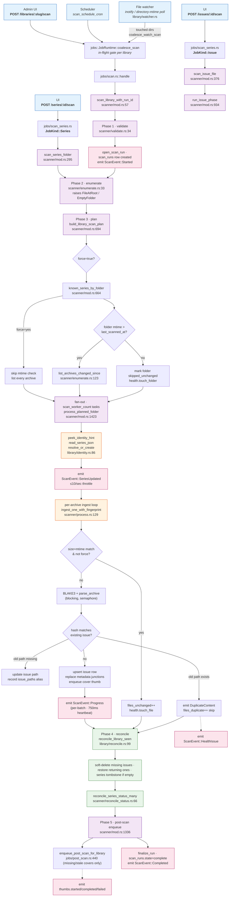

<!-- markdownlint-disable MD060 -->

# Library Scanner — Reference

The library scanner is the pipeline that turns a directory of CBZ
archives into the Folio database. It runs as an apalis background job,
streams real-time progress over a WebSocket, and is idempotent — running
the same scan twice produces the same DB state. This document is a
developer reference: it covers the architecture, the per-phase
walkthrough, what changes on a re-scan, every fast-path the scanner
uses to avoid redundant work, every health issue it can raise, every
event the live-scan UI consumes, and the operator surface.

Companion specs and wider context:

- [`comic-reader-spec.md`](../../comic-reader-spec.md) — overall product
  spec; the scanner is §4 (lifecycle), §6 (parsing), §7 (identity), §10
  (health issues), §14 (operations).
- [`docs/dev/phase-status.md`](phase-status.md) — what shipped when.

## End-to-end flow


```mermaid
flowchart TD
    classDef trig fill:#e3f2fd,stroke:#1565c0
    classDef phase fill:#f3e5f5,stroke:#6a1b9a
    classDef ingest fill:#fff3e0,stroke:#e65100
    classDef recon fill:#e8f5e9,stroke:#2e7d32
    classDef event fill:#fce4ec,stroke:#ad1457

    %% Triggers
    UI["Admin UI<br/><b>POST /libraries/:slug/scan</b>"]:::trig
    SR["UI<br/><b>POST /series/:id/scan</b>"]:::trig
    IR["UI<br/><b>POST /issues/:id/scan</b>"]:::trig
    FW["File watcher<br/><i>inotify / directory-mtime poll</i><br/>library/watcher.rs"]:::trig
    SCH["Scheduler<br/><i>scan_schedule_cron</i>"]:::trig

    UI --> COAL["jobs::JobRuntime::coalesce_scan<br/><i>in-flight gate per library</i>"]
    SCH --> COAL
    SR --> SS["jobs/scan_series.rs<br/><b>JobKind::Series</b>"]
    IR --> SS2["jobs/scan_series.rs<br/><b>JobKind::Issue</b>"]
    FW -->|"touched dirs<br/>coalesce_watch_scan"| COAL

    COAL --> SCAN["jobs/scan.rs::handle"]
    SS --> NARROW["scan_series_folder<br/>scanner/mod.rs:295"]:::phase
    SS2 --> ISCAN["scan_issue_file<br/>scanner/mod.rs:376"]:::phase
    SCAN --> SLIB["scan_library_with_run_id<br/>scanner/mod.rs:57"]:::phase

    SLIB --> VAL["Phase 1 · validate<br/>scanner/validate.rs:34"]:::phase
    NARROW --> ENUM
    ISCAN --> RIP["run_issue_phase<br/>scanner/mod.rs:934"]:::phase
    VAL --> OPEN["open_scan_run · scan_runs row created<br/>emit ScanEvent::Started"]:::event
    OPEN --> ENUM["Phase 2 · enumerate<br/>scanner/enumerate.rs:33<br/>raises FileAtRoot / EmptyFolder"]:::phase
    ENUM --> PLAN["Phase 3 · plan<br/>build_library_scan_plan<br/>scanner/mod.rs:694"]:::phase

    PLAN --> CHK{"force=true?"}
    CHK --> KSF["known_series_by_folder<br/>scanner/mod.rs:664"]
    KSF -- "force=yes" --> SKIP["skip mtime check<br/>list every archive"]
    KSF --> WALK{"folder mtime ><br/>last_scanned_at?"}
    WALK -- "no" --> MARKSKIP["mark folder skipped_unchanged<br/>health.touch_folder"]
    WALK -- "yes" --> WALKED["list_archives_changed_since<br/>scanner/enumerate.rs:123"]
    SKIP --> FAN
    WALKED --> FAN
    MARKSKIP --> FAN

    FAN["fan-out · scan_worker_count tasks<br/>process_planned_folder<br/>scanner/mod.rs:1423"]:::phase
    FAN --> IDH["peek_identity_hint<br/>read_series_json<br/>resolve_or_create<br/>library/identity.rs:86"]:::ingest
    IDH --> SUEV["emit ScanEvent::SeriesUpdated<br/>≤10/sec throttle"]:::event
    SUEV --> ING["per-archive ingest loop<br/>ingest_one_with_fingerprint<br/>scanner/process.rs:129"]:::ingest
    ING --> FFP{"size+mtime match<br/>& not force?"}
    FFP -- "yes" --> SKIP2["files_unchanged++<br/>health.touch_file"]
    FFP -- "no" --> HASH["BLAKE3 + parse_archive<br/>(blocking, semaphore)"]
    HASH --> DEDUP{"hash matches<br/>existing issue?"}
    DEDUP -- "old path missing" --> MOVE["update issue path<br/>record issue_paths alias"]
    DEDUP -- "old path exists" --> DUPE["emit DuplicateContent<br/>files_duplicate++ skip"]
    DEDUP -- "no" --> UPSERT["upsert issue row<br/>replace metadata junctions<br/>enqueue cover thumb"]
    UPSERT --> PROG["emit ScanEvent::Progress<br/>(per-batch · 750ms heartbeat)"]:::event

    PROG --> RECON
    SKIP2 --> RECON
    DUPE --> RECON
    DUPE -.-> HE["emit ScanEvent::HealthIssue"]:::event

    RECON["Phase 4 · reconcile<br/>reconcile_library_seen<br/>library/reconcile.rs:99"]:::recon
    RECON --> TOMB["soft-delete missing issues · restore returning ones · series tombstone if empty"]:::recon
    TOMB --> RST["reconcile_series_status_many<br/>scanner/reconcile_status.rs:66"]:::recon
    RST --> POST["Phase 5 · post-scan enqueue<br/>scanner/mod.rs:1336"]:::phase
    POST --> THUMBS["enqueue_post_scan_for_library<br/>jobs/post_scan.rs:440 (missing/stale covers only)"]
    THUMBS -.-> TS["emit thumbs.started/completed/failed"]:::event
    POST --> FIN["finalize_run · scan_runs.state=complete<br/>emit ScanEvent::Completed"]:::event
```

The diagram shows the library-scan path. The series and issue paths
short-circuit through `scan_series_folder` (mod.rs:295) and
`scan_issue_file` (mod.rs:376) respectively — they reuse the same
ingest pipeline but skip enumerate/plan and run a series-scoped
reconcile so unscanned siblings stay untouched.

## Triggers

| Trigger | Endpoint / source | Notes |
|---|---|---|
| Manual library scan | `POST /libraries/{slug}/scan` ([api/libraries.rs:480](../../crates/server/src/api/libraries.rs#L480)) | 202 + `{ scan_id, state, coalesced, mode, coalesced_into, queued_followup, reason }`. `mode=normal | content_verify` (the `ScanMode` enum at [api/libraries.rs:392](../../crates/server/src/api/libraries.rs#L392) has only these two arms — there is no `metadata_refresh` mode); `?force=true` remains a content-verify alias. Coalesces on an existing in-flight scan. |
| Manual series scan | `POST /series/{slug}/scan` | Per-folder rescan via [`jobs/scan_series.rs`](../../crates/server/src/jobs/scan_series.rs) with `JobKind::Series`. Manual clicks set `force=true`. |
| Manual issue scan | `POST /series/{series_slug}/issues/{issue_slug}/scan` | Same job type, `JobKind::Issue` — runs [`scan_issue_file`](../../crates/server/src/library/scanner/mod.rs#L376). |
| Scheduled scan | `library.scan_schedule_cron` per-library | [`jobs/scheduler.rs:224`](../../crates/server/src/jobs/scheduler.rs#L224) — `coalesce_scan(.., false)`. 5- or 6-field cron via `tokio_cron_scheduler`. |
| File watcher | `library.file_watch_enabled` per library ([library/watcher.rs](../../crates/server/src/library/watcher.rs)) | inotify on local mounts, directory-mtime poll on NFS/SMB/CIFS/FUSE (picked by `statfs` at watcher start). Touched directories are collapsed over `scanner.watch_debounce_secs` (30 s) and enqueued via [`JobRuntime::coalesce_watch_scan`](../../crates/server/src/jobs/mod.rs) as a **scoped, non-forced** library scan of those directories only ([`scan_library_scoped`](../../crates/server/src/library/scanner/mod.rs)). Shares the full scan's `scan:in_flight` / `scan:queued` keys, so a storm is one scan plus at most one queued follow-up. See [File watcher](#file-watcher). |

## Phase walkthrough

The library path (`scan_library_with_run_id` at
[mod.rs:57](../../crates/server/src/library/scanner/mod.rs#L57)) runs
five phases. Series and issue paths reuse phases 3–5 in a narrowed form.

### 4.1 Validate

- **Where**: [`scanner/validate.rs:34`](../../crates/server/src/library/scanner/validate.rs#L34)
- **Inputs**: the `library` row (path, id).
- **Checks** (fatal — `scan_runs.state='failed'` if any fails):
  - root path canonicalizes (else `RootMissing`)
  - is a directory
  - is readable and non-empty
  - is not equal to `COMIC_DATA_PATH` (`LoopWithDataPath`)
  - does not equal or contain another library's root
    (`OverlapsAnotherLibrary`)
- **Output**: `Result<(), ValidationError>`. The narrow series path uses
  the lighter [`folder_still_exists`](../../crates/server/src/library/scanner/validate.rs#L79)
  check instead.

### 4.2 Enumerate

- **Where**: [`scanner/enumerate.rs:33`](../../crates/server/src/library/scanner/enumerate.rs#L33)
  (called from [mod.rs:1130](../../crates/server/src/library/scanner/mod.rs#L1130) on a
  blocking thread).
- **Inputs**: library root + compiled `IgnoreRules`.
- **Outputs**: `EnumerationResult { series_folders: Vec<SeriesCandidate>,
  files_at_root, empty_folders, ambiguous_folders }`.
  - `SeriesCandidate` carries `path` and `publisher_hint`. The latter
    is `Some(name)` when the series sits beneath a publisher container
    (Layout B below) and `None` for flat layouts.
- **Layout rules** (spec §2.2, §5.1):
  - dot-prefixed entries (`.git`, `.DS_Store`, …) are silently skipped
  - built-in skips: `__MACOSX`, `Thumbs.db`, `desktop.ini`, `@eaDir`
  - user-glob ignores apply before classification

#### Two supported on-disk layouts

The library root may follow either shape; both are auto-detected and a
single library may mix them per-child (one flat series next to one
publisher container is fine).

- **Layout A (flat):** `root/Series/CBZ`. A series folder has CBZ files
  at its own depth-1. It MAY contain category subfolders (`Specials`,
  `Annuals`, `Oneshots`, `Extras`, `Bonus`, `Tie-Ins`) holding extra
  archives. The recursive archive walker slurps everything inside the
  series folder — non-allowlist subdirs are still walked, they just
  don't drive `special_type`.
- **Layout B (nested-by-publisher):** `root/Publisher/Series/CBZ`. A
  publisher folder has zero archives at its own depth-1; its children
  are Layout-A series folders. The depth-1 folder name becomes the
  `publisher_hint` for every series beneath it.

Each depth-1 child of the library root classifies independently per
this rule:

| Direct child contains                                       | Classification                            |
|---                                                          |---                                        |
| File at root                                                | `FileAtRoot` (Warning)                    |
| ≥1 archive at its depth-1                                   | **Series folder** (Layout A)              |
| 0 archives at depth-1, ≥1 non-allowlist subdir with archives | **Publisher folder** (Layout B)          |
| 0 archives at depth-1, only allowlist subdirs with archives | `AmbiguousFolder` (Warning) — series with only specials |
| 0 archives anywhere                                         | `EmptyFolder` (Info)                      |

Publisher folders are walked one level deeper. Inside, each grandchild
classifies the same way — but a publisher-inside-publisher (3-deep
nesting) is `AmbiguousFolder`, since Folio caps support at two levels.
Imprint metadata belongs in ComicInfo, not the filesystem.

Series-subfolder allowlist (case-insensitive): `Specials`, `Extras`,
`Bonus`, `Tie-Ins`, `Annuals`, `Annual`, `Oneshots`, `One-Shots`. See
[`enumerate::is_series_subfolder_name`](../../crates/server/src/library/scanner/enumerate.rs).
The same allowlist drives `special_type` assignment for archives
nested inside it (see §4.4 Process folder).

There is **no `scan_layout` override knob.** The folder shape is
self-describing; the auto-classifier handles both Layout A and Layout B
without per-library configuration.

### 4.3 Plan

- **Where**: [`build_library_scan_plan`](../../crates/server/src/library/scanner/mod.rs#L694).
- **What**: for each series-folder candidate, decide whether to walk it
  this scan, and if so list every recognized archive inside.
- **Fast-path branch** ([mod.rs:707–744](../../crates/server/src/library/scanner/mod.rs#L707-L744)):
  when `force=false` and the series row carries a `last_scanned_at`,
  call [`list_archives_changed_since`](../../crates/server/src/library/scanner/enumerate.rs#L123)
  — if the recursive max mtime ≤ `last_scanned_at`, the folder is
  marked `skipped_unchanged=true` and its archives are still listed
  (the walker collects them while looking at mtimes) but the folder
  short-circuits during processing.
- **Force branch**: keep the known-series cache active, but bypass the
  folder mtime skip and list archives in every folder.
- **Concurrency**: planning is parallelized at `scan_worker_count`
  via `buffer_unordered`.

### 4.4 Process folder (parallel)

- **Where**: [`process_planned_folder`](../../crates/server/src/library/scanner/mod.rs#L1423),
  fanned out from [mod.rs:1185](../../crates/server/src/library/scanner/mod.rs#L1185)
  with `buffer_unordered(scan_worker_count)`.
- **Inputs**: a `PlannedFolder { path, archives, known_series_id,
  skipped_unchanged, publisher_hint }`. `publisher_hint` is set when
  the series came from a Layout B (nested-by-publisher) classification
  in §4.2.
- **Steps** in order:

  1. **Skip-unchanged short-circuit**
     ([mod.rs:1439–1452](../../crates/server/src/library/scanner/mod.rs#L1439-L1452)).
     Folder is `skipped_unchanged` → bump `series_skipped_unchanged`,
     call `health.touch_folder` so the auto-resolve sweep does not
     close issues whose root cause is still on disk, return
     `processed=false`.
  2. **Series identity** ([mod.rs:1470–1520](../../crates/server/src/library/scanner/mod.rs#L1470-L1520)).
     Build a `SeriesIdentityHint` by merging, in precedence order
     (lowest-first):
     - `process::peek_identity_hint(&archives[0])` — first archive's
       ComicInfo + filename inference
     - `process::read_series_json(&folder)` — Mylar3 sidecar
       (gap-fills name, year, publisher, imprint, age_rating,
       total_issues, volume, comicvine_id; ComicInfo wins on
       overlapping fields per spec §6.7)
     - `publisher_hint` — parent folder name for Layout B. Last-resort
       fallback; only consulted when ComicInfo and series.json are both
       silent on publisher. Closes the "nested library shows no
       publisher" gap without operator config.

     Then call [`identity::resolve_or_create`](../../crates/server/src/library/identity.rs#L86):
     1. sticky `match_key` (admin override) — never overwritten
     2. `folder_path` exact match — fast path, just reuse the row
     3. normalized `name + year` — picks up renamed folders;
        backfills `folder_path` so the next scan takes the fast path
     4. otherwise create a new series row stamped with `folder_path`

     Then emit [`ScanEvent::SeriesUpdated`](../../crates/server/src/library/scanner/mod.rs#L1522)
     (≤10/sec/library throttle; see §Progress events).
  3. **Per-archive ingest loop**
     ([mod.rs:1535–1616](../../crates/server/src/library/scanner/mod.rs#L1535-L1616)).
     Build a path → row manifest, then for each archive:
     - `file_fingerprint` (size + mtime) →
     - if not `force` and the existing row's metadata is current →
       `files_unchanged++`, `health.touch_file`, skip;
     - else add to `candidates`.

     Process candidates in chunks of `scan_batch_size` per transaction
     ([mod.rs:1564–1616](../../crates/server/src/library/scanner/mod.rs#L1564-L1616)):
     a single ingest failure rolls back that batch only, the next
     batch still commits. Per-archive ingest is
     [`ingest_one_with_fingerprint`](../../crates/server/src/library/scanner/process.rs#L129),
     which handles:
     - extension dispatch for `.cbr` / `.cb7`
       ([process.rs](../../crates/server/src/library/scanner/process.rs),
       the `ConvertibleFormat` branch): both are read-only formats
       (RAR / 7z have no writer, and neither has random-access page
       streaming), so each is converted in place to a sibling `.cbz`
       (original kept as `.cbr.bak` / `.cb7.bak`) and the `.cbz`
       ingested when the library has the format's own opt-in —
       `auto_convert_cbr_on_scan` / `auto_convert_cb7_on_scan` — plus
       `allow_archive_writeback` on a writable mount
       ([scanner/cbr_convert.rs](../../crates/server/src/library/scanner/cbr_convert.rs));
       otherwise skipped with `UnsupportedArchiveFormat`. The converter
       picks the decoder by magic bytes (ZIP → plain rename, RAR →
       `unrar`, 7z → `sevenz-rust2`), not by extension
     - blocking BLAKE3 hash + ComicInfo + MetronInfo parse on a
       semaphore-protected pool
       ([process.rs:197–210](../../crates/server/src/library/scanner/process.rs#L197-L210))
     - archive-outcome dispatch: `Ok` / `MissingComicInfo` /
       `Encrypted` / `Malformed` / `Unreadable`
       ([process.rs:211–250](../../crates/server/src/library/scanner/process.rs#L211-L250))
     - ComicInfo PageCount storage as metadata only; mismatches with
       archive image count are ignored because the tag is frequently
       unreliable
     - DuplicateContent detection (hash collision under a different
       path) ([process.rs:311–327](../../crates/server/src/library/scanner/process.rs#L311-L327))
     - sticky user-pin (`field_provenance` `set_by='user'`) field
       protection on update
       ([process.rs:333](../../crates/server/src/library/scanner/process.rs#L333))
     - thumbnail invalidation — only when bytes actually changed
       ([process.rs:339, 411–428](../../crates/server/src/library/scanner/process.rs#L339))
     - cover-thumbnail enqueue
       ([process.rs:511 (insert path) and update path equivalent](../../crates/server/src/library/scanner/process.rs#L511))
     - `special_type` classification (spec §6.5) — see
       "special_type precedence" below
  4. **Stamp `last_scanned_at`**
     ([mod.rs:1621–1631](../../crates/server/src/library/scanner/mod.rs#L1621-L1631))
     so the next scan's folder mtime fast-path can fire.
  5. **Metadata rollup** — refresh genre/tag/credit junction tables
     for the series ([mod.rs:1635](../../crates/server/src/library/scanner/mod.rs#L1635)).
  6. **Status reconcile** — for narrow scans only; the library path
     defers this to a single batch call after Phase 4
     ([mod.rs:1645–1652](../../crates/server/src/library/scanner/mod.rs#L1645-L1652),
      see §Fast-paths).

#### `special_type` precedence

Per
[`detect_special_type`](../../crates/server/src/library/scanner/process.rs).
Rules are evaluated top-to-bottom; the first match wins:

| Rule | Source | Wins over |
|---|---|---|
| ComicInfo `<Format>` | author signal | everything |
| Allowlist subfolder name | path | filename heuristics |
| Filename `Annual` token | heuristic | none |
| Filename `_SP_` / `special` token | heuristic | none |
| No recognizable issue number | filename | none → `OneShot` |

Allowlist-subfolder → tag mapping:

| Subfolder name (case-insensitive)                | `special_type` |
|---                                               |---             |
| `Specials`, `Extras`, `Bonus`, `Tie-Ins`         | `Special`      |
| `Annuals`, `Annual`                              | `Annual`       |
| `Oneshots`, `One-Shots`                          | `OneShot`      |

The series folder is established by §4.2 classification; the
comparison happens via `path.parent() != series_folder` so an
archive sitting directly in the series folder always falls through
to the filename/format heuristics.

### 4.5 Reconcile

Two reconciles run after all folders complete:

- **Tombstone reconcile**:
  [`reconcile_library_seen`](../../crates/server/src/library/reconcile.rs#L99)
  ([called from mod.rs:1303](../../crates/server/src/library/scanner/mod.rs#L1303)).
  - For every issue in scanned series: missing on disk →
    `removed_at = now()`; soft-deleted but back → clear
    `removed_at` (and `removal_confirmed_at`).
  - Series whose `folder_path` no longer exists on disk: soft-delete
    every issue and the series row itself.
  - [`mark_empty_series_removed`](../../crates/server/src/library/reconcile.rs#L310-L338)
    flips the series row to removed when the last active issue is
    gone.
- **Status reconcile**:
  [`reconcile_series_status_many`](../../crates/server/src/library/scanner/reconcile_status.rs#L66)
  ([called from mod.rs:1316](../../crates/server/src/library/scanner/mod.rs#L1316)).
  - Recompute `series.status`, `series.total_issues`,
    `series.summary`, and `series.comicvine_id`.
  - Precedence: **manual override** (`status_user_set_at IS NOT NULL`)
    > **`series.json` sidecar** (status / total_issues / summary /
    comicid) > **`MAX(issues.comicinfo_count)`** > **default** (leave
    existing values; never overwrite `total_issues` with `NULL`).

The narrow per-series path in
[`reconcile::reconcile_series`](../../crates/server/src/library/reconcile.rs#L175)
runs the same logic scoped to one series so siblings stay untouched.
The auto-confirm sweep that flips `removal_confirmed_at` after
`library.soft_delete_days` runs as a separate cron (§Operations).

### 4.6 Post-scan enqueue

Best-effort: failure here doesn't fail the scan. Enqueues only the
downstream work that has real post-scan value:

- `enqueue_post_scan_for_library` →
  [post_scan.rs:440](../../crates/server/src/jobs/post_scan.rs#L440) —
  cover thumbnail jobs for active issues whose covers are missing,
  stale, or errored. Page-map strips are lazy/explicit admin work.
- `hash_backfill::enqueue_if_pending` — one indexed probe; when the
  library has rows whose content hash is still pending (first-import
  lazy-hash mode), enqueue the `hash_backfill` drain. Runs after series
  scans too, so a restart that abandoned a drain resumes on the next scan.
- `relationship_suggest::enqueue` (WP-7.2) — when the scan changed
  anything (files added/updated, series created/removed, issues
  removed/restored), queue a relationship-suggestion run for the library.
  Deduped per library by the Redis key `relsuggest:queued:<library_id>`;
  runs after series-scoped and watcher-scoped scans too, and stays bounded
  because the job is library-wide, set-based and capped at 1000 rows. See
  [series-relationships.md § Suggestion engine](series-relationships.md#suggestion-engine-wp-72).
- `spawn_cbl_rematch_all` ([mod.rs:1389](../../crates/server/src/library/scanner/mod.rs#L1389))
  — saved-views: when the scan added/restored issues, re-resolve
  previously-missing CBL entries fire-and-forget.

[`finalize_run`](../../crates/server/src/library/scanner/mod.rs#L467)
then closes out the scan: persists `health.finalize`, updates the
`scan_runs` row to `complete` / `failed`, and emits
`ScanEvent::Completed` or `ScanEvent::Failed`.

## Re-scan behaviour

A re-scan runs the same five phases but is shaped by what's already in
the DB:

- **Folder-level mtime check** — when `force=false` and the series row
  has a `last_scanned_at`,
  [`list_archives_changed_since`](../../crates/server/src/library/scanner/enumerate.rs#L123)
  short-circuits the folder if its recursive max mtime ≤
  `last_scanned_at`. The folder is marked `skipped_unchanged`
  and `process_planned_folder` returns immediately.
- **Per-file size+mtime fingerprint** — even on a folder that *did*
  change, individual archives whose size+mtime match the existing row
  bypass hash + parse and only count toward `files_unchanged`
  ([process.rs:164–175](../../crates/server/src/library/scanner/process.rs#L164-L175)).
  PostgreSQL `timestamptz` truncates writes to microsecond precision,
  so the scanner truncates the `fs` mtime to the same precision before
  comparing — without this the round-trip would never match and every
  rescan would re-hash everything
  ([process.rs:147–152, 518–522](../../crates/server/src/library/scanner/process.rs#L147-L152)).
- **`comicinfo_count` backfill override** — rows that pre-date the
  richer parser (no `comicinfo_count`, no raw `count` in
  `comic_info_raw`) are forced through full re-ingest even if size+mtime
  match. One-shot self-heal
  ([process.rs:540–556](../../crates/server/src/library/scanner/process.rs#L540-L556)).
- **User-pin stickiness on update** — fields the user has edited
  via `PATCH /series/{series_slug}/issues/{issue_slug}` carry a
  `set_by='user'` `field_provenance` row and are not refreshed from
  ComicInfo. Slotted columns are gated by `protected(MetadataField)`
  (which also keeps provider-set values, WP-2.5); `sort_number`,
  `number_raw`, `black_and_white`, `alternate_series` and `web_url` are
  gated by their column-key pin. External ids are guarded by
  `writers::set_external_id`'s own precedence rule. (The legacy
  `issues.user_edited` JSON list was retired in WP-3.7 — see
  [schema-restructure.md](schema-restructure.md#retirement-of-issueuser_edited-wp-37).)
- **Thumbnail invalidation only on content change** — the update path
  recomputes `content_changed = !row_matches_file(row, size, mtime)`
  ([process.rs:339](../../crates/server/src/library/scanner/process.rs#L339))
  and only clears `thumbnails_generated_at` / wipes the strip dir when
  it's `true`. A `force=true` scan on size+mtime-equal files re-parses
  ComicInfo but does not re-thumb
  ([process.rs:411–428](../../crates/server/src/library/scanner/process.rs#L411-L428)).
- **Per-user anchors follow their pages on content change** (roadmap
  WP-1.2 + WP-6.2) — when `content_changed`, the scanner drops the
  issue's cached `zip_lru` handle (it still points at the old bytes) and
  re-anchors every marker and progress row on the issue
  (`reading::page_remap::reanchor_issue`, `Authority::Hash`). Anchors
  that carry a `page_hash` move to wherever that image now sits; anchors
  without one (written before WP-6.2), or whose image is gone, keep their
  ordinal, or are pulled onto the last page with a `page-removed` tag when
  the page count shrank. A marker whose image vanished while its ordinal
  survived gets the `page-drift` tag. The new archive is hashed only when
  some anchor on the issue has a hash to match. See
  [reading-progress.md](reading-progress.md#page-anchoring-when-the-archive-changes).
- **Soft-delete + return lifecycle** — files missing on disk are
  `removed_at = now()`. The row stays so user progress, bookmarks, and
  reviews aren't lost. A returning file (same content hash, same path)
  clears `removed_at` and `removal_confirmed_at` on the next scan
  ([reconcile.rs:99–164, 273–304](../../crates/server/src/library/reconcile.rs#L99-L164)).
  When every issue in a series is removed,
  [`mark_empty_series_removed`](../../crates/server/src/library/reconcile.rs#L310-L338)
  flips the series row too.
- **Auto-confirm cron** —
  [`auto_confirm_sweep`](../../crates/server/src/library/reconcile.rs#L342)
  runs daily at 04:00 UTC
  ([scheduler.rs:357–361](../../crates/server/src/jobs/scheduler.rs#L357-L361))
  and stamps `removal_confirmed_at` on rows whose `removed_at` is older
  than `library.soft_delete_days`. The scanner itself never
  hard-deletes; that is the purge sweep's job (next bullet).
- **Hard-purge cron** (roadmap WP-3.5) —
  [`jobs::hard_purge`](../../crates/server/src/jobs/hard_purge.rs) runs
  daily at 04:15 UTC (between the 04:00 auto-confirm and the 04:30
  thumbnail orphan sweep, which then reaps the purged ids' thumbs) and
  hard-`DELETE`s issues whose `removal_confirmed_at` is older than
  `library.soft_delete_days × library.hard_purge_multiplier` days
  (global setting, default `2`, `0` disables; window floor 1 day; at
  most 5 000 issues per library per run). See **Removal lifecycle**
  below.
- **`series.json` re-read every scan** — there is no caching layer;
  changes to the sidecar take effect on the next pass through the
  folder ([mod.rs:1479](../../crates/server/src/library/scanner/mod.rs#L1479)).
- **Move detection (move-vs-duplicate)** — content-hash based: if a
  file's path is new but its hash matches an existing row and the old
  path is gone, the scanner updates the issue's primary path and records
  the old/new paths in `issue_paths`. If the old path still exists, it
  emits `DuplicateContent` and skips the new file.
  - **Library-scoped** (WP-3.3, audit DI-21): only rows in the *same*
    library match. The same file in two libraries is two issues, and
    neither is flagged.
  - **`dedupe_by_content`** is honoured: with the flag off, a second live
    copy in the same library is ingested as its own issue (no health
    row) and surfaces on the Duplicates page instead. Move detection
    runs either way.
  - **Issue id fallback**: a new row's id is the content hash unless
    that id is already taken (other library, dedupe off, or a retagged
    row's historical id), in which case it is `blake3(path)` — the
    spec §5.1.2 path id. The per-path lookup keeps it stable on rescans
    ([`allocate_issue_id`](../../crates/server/src/library/scanner/process.rs)).

## Fast-paths and bypasses

| # | Mechanism | Where | Skip predicate | Bypass |
|---|---|---|---|---|
| 1 | Folder mtime fast-path | [build_library_scan_plan mod.rs:707–744](../../crates/server/src/library/scanner/mod.rs#L707-L744), [enumerate.rs:123–161](../../crates/server/src/library/scanner/enumerate.rs#L123-L161) | `force=false` ∧ recursive max mtime ≤ `series.last_scanned_at` → mark folder `skipped_unchanged`, call `health.touch_folder`, return `processed=false`. | `?force=true` on `POST /libraries/:slug/scan`. |
| 2 | Per-file size+mtime fingerprint | [process.rs:164–175](../../crates/server/src/library/scanner/process.rs#L164-L175), [mod.rs:1543–1554](../../crates/server/src/library/scanner/mod.rs#L1543-L1554) | `force=false` ∧ existing row's `(file_size, file_mtime)` match disk ∧ no `comicinfo_count` backfill needed → `files_unchanged++`, `health.touch_file`, skip hash + parse. | Same `force=true` from any tier; default `true` for manual series/issue scans, `false` for scheduled / startup library scans. |
| 3 | `comicinfo_count` backfill override | [process.rs:540–556](../../crates/server/src/library/scanner/process.rs#L540-L556) | When a row lacks both `comicinfo_count` and a raw `count` in `comic_info_raw`, treat the row as stale and force a re-ingest *even when* size+mtime match. | Inverts (1) — there is no bypass; the override fires automatically. |
| 4 | Thumbnail invalidation skip | [process.rs:339, 411–428](../../crates/server/src/library/scanner/process.rs#L339) | On the update path, when `row_matches_file(row, size, mtime)` is true, skip clearing `thumbnails_generated_at` and skip wiping the strip dir. | None — this is always desired. |
| 5 | Batch-rollback isolation | [mod.rs:1564–1616](../../crates/server/src/library/scanner/mod.rs#L1564-L1616) | One ingest failure rolls back its `scan_batch_size` chunk (default 100) and continues; the rest of the folder still commits. | None. |
| 6 | Deferred status reconcile (full scans) | [mod.rs:1316](../../crates/server/src/library/scanner/mod.rs#L1316), [reconcile_status.rs:66](../../crates/server/src/library/scanner/reconcile_status.rs#L66) | Library scans defer per-folder `reconcile_series_status` and run a single batch call after Phase 4 instead of N small ones. | Per-series scans run the helper inline ([mod.rs:1647](../../crates/server/src/library/scanner/mod.rs#L1647)). |
| 7 | Health touch-on-skip | [mod.rs:1445](../../crates/server/src/library/scanner/mod.rs#L1445), [process.rs:173](../../crates/server/src/library/scanner/process.rs#L173) | Skipped files / folders call `health.touch_file` / `touch_folder` so the auto-resolve sweep does not close issues whose root cause is still on disk but wasn't re-emitted. | None. |
| 8 | Per-scan series identity cache | [known_series_by_folder mod.rs:664–679](../../crates/server/src/library/scanner/mod.rs#L664-L679) | One `SELECT folder_path, id, last_scanned_at FROM series WHERE library_id = ?` at planning time; reused across every folder. Avoids N folder-by-folder lookups. | `force=true` still uses this cache; it only bypasses the mtime/content fast paths. |
| 9 | In-memory live-progress tracker | [LiveProgressTracker mod.rs:182–274](../../crates/server/src/library/scanner/mod.rs#L182-L274), 750 ms heartbeat at [mod.rs:1216–1287](../../crates/server/src/library/scanner/mod.rs#L1216-L1287) | Atomic counters in memory; `scan_runs.stats` JSON is written only on actual progress changes or every 750 ms. Prevents per-file DB churn during a scan. | None. |
| 10 | Force-rescan tiers | [api/libraries.rs:464](../../crates/server/src/api/libraries.rs#L464), [jobs/scan_series.rs:60](../../crates/server/src/jobs/scan_series.rs#L60), [process.rs:129–146, 164](../../crates/server/src/library/scanner/process.rs#L129-L146) | `force` propagates from the trigger through the job into `process_planned_folder` and `ingest_one_with_fingerprint`, disabling (1), (2), and the `defer_status_reconcile` short-circuit. | The `force` param itself is the bypass. Library default `false`; manual series/issue clicks default `true`. |
| 11 | Move/dedupe shortcut | [process.rs:311–327](../../crates/server/src/library/scanner/process.rs#L311-L327) | Before `INSERT`ing a new issue row, check whether an existing row already has this content hash as its id. If the old path is missing, update the issue path and maintain `issue_paths`; if the old path still exists, emit `DuplicateContent` and `files_duplicate++`. Without this, the insert would PK-violate and roll back the entire batch. | None — the scanner always checks. |
| 12 | First-import lazy hash (WP-3.2) | [`process.rs::lazy_hash_eligible`](../../crates/server/src/library/scanner/process.rs), [`jobs/hash_backfill.rs`](../../crates/server/src/jobs/hash_backfill.rs) | Library has `trust_fingerprint_on_first_import` ∧ `last_scan_at IS NULL` ∧ no row for the path → skip the full-file BLAKE3 (the archive parse still runs), insert with `hash_algorithm = 0`, id = `content_hash` = [`lazy_fingerprint(path, size, mtime)`](../../crates/server/src/library/scanner/process.rs), skip the dedupe check (#11), `files_hash_deferred++`. See [First-import lazy-hash mode](#first-import-lazy-hash-mode). | Off by default. Changed files (update path) always hash; once the first full scan completes, new files hash inline again. |

All entries are production-ready against current `master`.

## First-import lazy-hash mode

Roadmap WP-3.2 (audit §3.1 "Import"). On a NAS or spinning disk the
BLAKE3 pass dominates a cold import — every archive is read end to end
before the first issue shows up. A library with
`trust_fingerprint_on_first_import = true` trades that for a two-step
import:

1. **Scan.** While the library has never completed a full scan
   (`last_scan_at IS NULL`), a file with no row is ingested on size+mtime
   alone. The archive parse (central directory, sidecar XML, page header
   probe) still runs, so series/issue metadata, page counts and covers are
   there immediately. The row gets `hash_algorithm = 0` ("pending") and
   `id = content_hash = lazy_fingerprint(path, size, mtime)` — a
   domain-separated BLAKE3 of the path fingerprint (spec §5.1.2's
   `blake3(path)` identity, salted with size+mtime so a different file
   later landing on the same path during an unfinished first import can't
   collide). Ingest-time dedupe (#11) is skipped — there is no content
   hash to compare. `bytes_hashed` stays 0; `files_hash_deferred` counts
   the rows.
2. **Backfill.** The scan's post-scan step enqueues
   [`HashBackfillJob`](../../crates/server/src/jobs/hash_backfill.rs)
   (apalis queue `hash_backfill`, concurrency 1, shares the scanner's
   archive-work semaphore). It walks the library's pending rows by id,
   re-stats each file (missing or size/mtime drifted → left pending for
   the next scan), hashes it, re-stats again, and stamps `content_hash` +
   `hash_algorithm = 1` under a `WHERE hash_algorithm = 0 AND file_size = …
   AND file_mtime = …` guard so a concurrent rescan always wins.
3. **Dedupe re-check.** After hashing, another settled row in the same
   library with the same content hash whose file still exists makes this
   a duplicate. The redundant row is hard-deleted (its `external_ids` /
   `field_provenance` rows too) — preferring to keep whichever copy has
   reading progress, else the one settled first — and the job enqueues a
   non-force scoped rescan of that series folder, which re-ingests the
   dropped path through the normal hashed path and emits the standard
   `DuplicateContent` health issue. The end state matches an inline-hashed
   import. (A matching row whose file is gone is a pre-move row; the next
   reconcile soft-deletes it.)
   The re-check follows the same policy as ingest-time dedupe (WP-3.3):
   with `dedupe_by_content = false` it **never** deletes — both copies
   stay as separate issues and the Duplicates page groups them; and a row
   carrying an `issue_duplicate_decision` is never the one deleted (it is
   kept over an undecided copy; if both copies are decided, both stay).

**Id allocation.** New rows get their id from the single allocator
`process.rs::allocate_issue_id`, with precedence: pending row → lazy
fingerprint; settled row → content hash; either one already taken →
`blake3(path)`.

**Identity.** The id is never re-keyed when the hash lands (`issues.id`
stable / `content_hash` mutable — see Carry-over below), so progress,
markers, thumbnails and URLs created during the backfill survive it. A
retag after the backfill is detected like any other (size+mtime change →
update path → new `content_hash`, same id). A retag *before* the backfill
settles the row through the update path, which always hashes and sets
`hash_algorithm = 1`.

**Progress.** `GET /api/libraries/{slug}/hash-backfill` returns
`{pending, total, hashed, enabled, first_import_active}` off the
`issues_hash_pending_idx` partial index; the library settings page polls
it while `pending > 0` and offers a Resume button
(`POST /api/libraries/{slug}/hash-backfill`, audited as
`admin.library.hash_backfill.start`). The queue shows up as "Content
hashing" on `/admin/queue`, and each drain writes one `library_events` row
(category `file`, action `completed`, `detail.kind = "hash_backfill"`).

**Known limits.** A file moved *while its row is still pending* is not
recognised as a move (there is no content hash to match): the new path
ingests as a new row and the old row is soft-deleted by reconcile.
Caches keyed by `content_hash` (page ETags, page variants, OCR) turn over
once when the real hash lands. Account export carries the placeholder
hash for rows that are still pending.

## Health issues

The scanner emits `IssueKind` variants through a per-scan
[`HealthCollector`](../../crates/server/src/library/health.rs#L226)
that buffers them and persists in a single batch upsert at
`finalize_run` time. Storage is `library_health_issues.payload` —
opaque JSON so adding variants doesn't need a migration.

### Lifecycle

- Each row is keyed on `(library_id, fingerprint)`. Re-emitting the
  "same" issue across scans updates the existing row instead of
  duplicating it (
  [`fingerprint`](../../crates/server/src/library/health.rs#L124)).
- **Auto-resolve** — at `finalize`, library-wide scans set
  `resolved_at = now()` on any open row whose `last_seen_at` is older
  than the scan started
  ([health.rs:412–423](../../crates/server/src/library/health.rs#L412-L423)).
  Narrow per-series / per-issue scans skip this so they don't close
  issues outside their scope
  ([health.rs:262–267](../../crates/server/src/library/health.rs#L262-L267)).
- **Touch-on-skip** keeps issues alive when the scanner short-circuited
  past the file or folder that emitted them; see fast-path #7
  ([health.rs:373–410](../../crates/server/src/library/health.rs#L373-L410)).
- **Manual dismiss** — `dismissed_at` is permanent; auto-resolve never
  clears it
  ([health.rs:331](../../crates/server/src/library/health.rs#L331)).
  Endpoint: `POST /libraries/{slug}/health-issues/{issue_id}/dismiss`.

### Actively emitted

| Kind | Severity | Trigger | Emitter | Payload | Fix |
|---|---|---|---|---|---|
| `FileAtRoot` | warning | Archive sits at the library root, not inside a series folder. | [enumerate Phase 2 → mod.rs:1138](../../crates/server/src/library/scanner/mod.rs#L1138) | `{ path }` | Move into a series folder. |
| `EmptyFolder` | warning | Direct child of root has no entries. | [enumerate Phase 2 → mod.rs:1141](../../crates/server/src/library/scanner/mod.rs#L1141) | `{ path }` | Add files or remove the folder. |
| `AmbiguousFolder` | warning | Folder violates the two-layouts contract: archives at depth-1 *and* non-allowlist archive-bearing subdirs; or no archives at depth-1 with only allowlist subdirs; or 3-deep nesting; or a stray archive directly inside a publisher folder. The subtree is skipped — better than guessing. | [enumerate Phase 2 → mod.rs](../../crates/server/src/library/scanner/mod.rs) | `{ path, reason, skipped_archives, skipped_archive_count }` — `reason` carries an actionable hint that adapts to the violation shape; `skipped_archives` is a sorted preview (≤ `enumerate::AMBIGUOUS_PREVIEW_LIMIT` = 20) of the skipped archives relative to `path`, `skipped_archive_count` the exact total (WP-3.4). Rows written before WP-3.4 lack both until the next full scan. | Fix the on-disk layout per §4.2 "Two supported on-disk layouts". |
| `OrphanedSeriesJson` | warning | A folder with no archives still holds a `series.json` — the sidecar outlived its archives. Reported *instead of* `EmptyFolder` for that folder (root children and folders under a publisher container). | [enumerate Phase 2 → mod.rs](../../crates/server/src/library/scanner/mod.rs) | `{ folder }` | Restore the archives, or delete the folder. |
| `FolderNameMismatch` | warning | The series folder's name disagrees with the dominant ComicInfo `<Series>` of its non-special archives (spec §7.1 — ComicInfo still wins for the series name). See "Folder consistency checks" below for the normalization that keeps this quiet on healthy libraries. | [folder_checks.rs](../../crates/server/src/library/scanner/folder_checks.rs), called from `process_planned_folder` after ingest | `{ folder, series_id, comic_info_series, files }` | Rename the folder, or re-tag the archives if the folder is right. |
| `MixedSeriesInFolder` | warning | Non-special archives in one series folder carry more than one distinct `<Series>` (spec §7.2). All files stay attributed to the folder's series. | [folder_checks.rs](../../crates/server/src/library/scanner/folder_checks.rs) | `{ folder, series_id, series_values: [{ series, files, example }], distinct_values }` — values sorted most-files-first, capped at `MIXED_SERIES_VALUES_LIMIT` = 10; `example` is one file (relative to the folder) carrying the value. | Move the stray archives into their own series folder. |
| `UnreadableFile` | error | Per-issue scan target is masked by the library's ignore globs. | [run_issue_phase mod.rs:995](../../crates/server/src/library/scanner/mod.rs#L995) | `{ path, error }` | Adjust `library.ignore_globs`, or move the file out of the ignored path. |
| `UnreadableArchive` | error | OS / archive-layer I/O error opening the archive. | [process.rs:244](../../crates/server/src/library/scanner/process.rs#L244) | `{ path, error }` | Check perms, replace the file. |
| `MissingComicInfo` | info | Archive has no `ComicInfo.xml`. **Gated** on `library.report_missing_comicinfo=true` — loose libraries don't get spammed by default. | [process.rs:222](../../crates/server/src/library/scanner/process.rs#L222) | `{ path }` | Tag with ComicTagger / Mylar, or flip the per-library setting off. |
| `MalformedComicInfo` | error | `ComicInfo.xml` exists but XML parse failed. | [process.rs:235](../../crates/server/src/library/scanner/process.rs#L235) | `{ path, error }` | Re-tag. |
| `DuplicateContent` | warning | A new file's BLAKE3 hash matches an existing issue's `content_hash` **in the same library**, the existing path is still present, and `dedupe_by_content` is on (fast-path #11). | [process.rs:314](../../crates/server/src/library/scanner/process.rs#L314) | `{ path_a, path_b }` (paths sorted alphabetically — fingerprint is order-stable). | Decide which copy to keep; renamed files whose old path is gone are handled as moves. |
| `UnsupportedArchiveFormat` | warning | `.cbr` / `.cb7`: only when the library has the format's flag off (`auto_convert_cbr_on_scan` / `auto_convert_cb7_on_scan`) **or** the conversion failed (not ZIP/RAR/7z by magic bytes, encrypted, an archive cap or the 7z decoder-memory cap exceeded, I/O error). With the flag on, the scanner converts the file to a sibling `.cbz` via [scanner/cbr_convert.rs](../../crates/server/src/library/scanner/cbr_convert.rs) and ingests that instead — no health row. | [process.rs](../../crates/server/src/library/scanner/process.rs) (`ConvertibleFormat` branch) | `{ path, ext }` | Enable the matching conversion flag on the library (needs `allow_archive_writeback`), or convert to CBZ by hand. |
| `SkippedArchiveEntries` | warning | The archive opened, but one or more entries were dropped from the page index by a soft defense in the archive crate. One row per `reason`: `compression ratio cap` (CBZ entry claiming >200× expansion) or `image extension but non-image content` (an image-named entry whose leading bytes carry no image signature — the "`ComicInfo.xml` saved as `-0001.jpg`" publisher bug; every reader content-sniffs page candidates at open via [`archive::image_sniff`](../../crates/archive/src/image_sniff.rs)). The issue ingests with the surviving pages, so cover thumbnails, the reader and OCR all agree on page 0. | [process.rs](../../crates/server/src/library/scanner/process.rs) (translates `entries_skipped()`) | `{ path, dropped, total, reason }` | Repack the archive without the offending entry, or leave it — nothing downstream reads it. |

### Folder consistency checks (WP-3.4)

`FolderNameMismatch` and `MixedSeriesInFolder` run once per processed
series folder, after its archives are ingested
([`folder_checks::check_series_folder`](../../crates/server/src/library/scanner/folder_checks.rs)).
Inputs are the folder's active issues projected to `file_path`,
`special_type` and `comic_info_raw->>'series'`, intersected with the
folder's current on-disk archive list (the soft-delete reconcile for
vanished files runs after every folder, so a just-deleted stray must not
count). One projected query per processed folder; it deliberately does
**not** sit behind the PERF-2 `folder_mutated` gate, because removing a
stray file ingests nothing yet changes the verdict. Folders skipped by
the folder-level fast path are `touch_folder`-ed, which keeps their rows
open; full scans auto-resolve rows no longer re-emitted, scoped
(series/issue) scans never auto-resolve.

Noise control — both sides of every comparison go through
`folder_checks::series_key`:

1. Bracket groups are dropped: `(2016)`, `[cv-4050-12345]`, `(Digital)`.
2. [`title_norm::sanitize_title`](../../crates/server/src/metadata/title_norm.rs)
   folds case, accents, quotes, punctuation (`X-Men: Blue` = `X-Men - Blue`)
   and ComicTagger's article list (`The`, `&`/`and`, …) — the matcher's
   own normalization, so scanner and matcher agree on "same name".
3. Volume tokens (`v2`, `Vol. 3`, `Volume 3`) are dropped.
4. Trailing bare numbers are dropped (`Batman 2016`, and issue-folder
   layouts such as `Publisher/Batman 001/Batman 001.cbz`), unless the
   number is the whole name (`1602`).

Further suppressions: files with a `special_type` (allowlisted
`Specials`/`Annuals` subfolders, annual/one-shot formats) are ignored —
`Batman Annual` inside `Batman/` is normal; no row is emitted when no
file carries a ComicInfo `<Series>`; `FolderNameMismatch` is suppressed
when the folder's `series.json` `name` has the same key as the dominant
ComicInfo value (the sidecar confirms the identity, the folder name is
just a label); `MixedSeriesInFolder` ignores values whose key matches a
recorded [`series_provider_range`](../../crates/entity/src/series_provider_range.rs)
`provider_series_name` (a tracked provider-divergence split, whose
identity writeback composes into the per-issue `<Series>`).

### Removed: `AmbiguousVolume` (WP-3.4)

`AmbiguousVolume` ("`<Volume>` couldn't be classified as year vs
sequence", spec §6.4) was never emitted and has been deleted from
`IssueKind`. Volume classification is deterministic — every `V<N>`
source goes through `parsers::filename::plausible_volume` (1–99 and not
equal to the year, otherwise dropped) — so there is no ambiguous outcome
to report, and flagging every Mylar3 `V<year>` stamp would bury the
findings page. The wire `kind` is a plain string (no OpenAPI enum), and
no rows of this kind can exist, so no migration or oasdiff exception is
needed; any stray row would be auto-resolved by the next full scan.

## Progress events

Live-scan UI consumes events over `GET /ws/scan-events`
([api/ws_scan_events.rs](../../crates/server/src/api/ws_scan_events.rs)).
Auth is admin-only via cookie session or one-time ticket from
`POST /auth/ws-ticket`. The transport is a Tokio `broadcast` channel of
capacity 1024
([events.rs:28](../../crates/server/src/library/events.rs#L28));
laggy receivers get a `lagged` advisory frame
([ws_scan_events.rs:115–121](../../crates/server/src/api/ws_scan_events.rs#L115-L121))
and are expected to refresh manually. The schema lives in
[`ScanEvent`](../../crates/server/src/library/events.rs#L31-L121).

| Event | Where emitted | Payload | Notes |
|---|---|---|---|
| `scan.started` | [mod.rs:76](../../crates/server/src/library/scanner/mod.rs#L76), [343](../../crates/server/src/library/scanner/mod.rs#L343), [408](../../crates/server/src/library/scanner/mod.rs#L408) | `{ library_id, scan_id, at }` | Once per scan. UI clears prior progress, switches to "running". |
| `scan.progress` | [emit_progress mod.rs:609–662](../../crates/server/src/library/scanner/mod.rs#L609-L662); also writes a `scan_runs.stats` snapshot | `{ library_id, scan_id, kind, phase, unit, completed, total, current_label, files_seen, files_added, files_updated, files_unchanged, files_skipped, files_duplicate, issues_removed, health_issues, series_scanned, series_total, series_skipped_unchanged, files_total, root_files, empty_folders, elapsed_ms?, phase_elapsed_ms?, files_per_sec?, bytes_per_sec?, active_workers?, dirty_folders?, skipped_folders?, eta_ms? }` | Cumulative counters plus optional live throughput/timing fields. Phase strings: `planning`, `planning_complete`, `scanning`, `reconciling`, `reconciled`, `enqueueing_thumbnails`, `complete`. Unit strings: `planning`, `work`, `file`. Heartbeat at 750 ms during the scanning phase only when counters changed ([mod.rs:1216–1287](../../crates/server/src/library/scanner/mod.rs#L1216-L1287)). |
| `scan.series_updated` | [mod.rs:1522](../../crates/server/src/library/scanner/mod.rs#L1522) | `{ library_id, series_id, name }` | Fires once per series-folder enter. **Throttled** to ≤10/sec/library by the broadcaster ([events.rs:29, 158–170](../../crates/server/src/library/events.rs#L29-L170)). UI tail shows ~8 most recent. |
| `scan.health_issue` | [health.rs:280–288](../../crates/server/src/library/health.rs#L280-L288) | `{ library_id, scan_id, kind, severity, path? }` | Fires on every emitted issue (not throttled — issue volume is bounded by file count). UI toasts only `error` severity by default. |
| `scan.completed` | [mod.rs:515](../../crates/server/src/library/scanner/mod.rs#L515) | `{ library_id, scan_id, added, updated, removed, duration_ms }` | Once per successful scan. UI invalidates queries (scan_runs, health, series, removed-issues). |
| `scan.failed` | [mod.rs:523](../../crates/server/src/library/scanner/mod.rs#L523) | `{ library_id, scan_id, error }` | Same shape as completed, terminal too. |
| `thumbs.started` | [post_scan.rs handle_thumbs](../../crates/server/src/jobs/post_scan.rs#L101) | `{ library_id, issue_id, kind }` (`cover` / `page_map` / `cover_page_map`) | Post-scan worker, not the scanner — but visible on the same WS. |
| `thumbs.completed` | post_scan.rs, success branch | `{ library_id, issue_id, kind, pages }` | `pages` is strip count; cover is implied. |
| `thumbs.failed` | post_scan.rs, error branch | `{ library_id, issue_id, kind, error }` | UI toasts. |
| `lagged` | [ws_scan_events.rs:118](../../crates/server/src/api/ws_scan_events.rs#L118) | `{ "type": "lagged", "skipped": n }` | Not part of `ScanEvent`; raw JSON. Sent when the broadcast receiver fell behind. Client may refresh. |

### What's persisted

The `scan_runs` table
([entity/scan_run.rs](../../crates/entity/src/scan_run.rs)) is the
durable side of the live channel. Fields:

| Column | Type | Notes |
|---|---|---|
| `id` | uuid | The `scan_id` referenced in events. |
| `library_id` | uuid | |
| `state` | text | `queued` / `running` / `complete` / `failed` / `cancelled`. `queued` rows are pre-inserted at enqueue time; a run that fails before it opens (library gone, validation) or whose job is cleared from the queue is closed by `fail_unstarted_run` / `cancel_queued_runs`. |
| `batch_id` | uuid? | The scan-all batch (`scan_batch`) the run belongs to. |
| `started_at`, `ended_at` | timestamptz | `ended_at` set by `finalize_run`. |
| `stats` | jsonb | Last `ScanStats` snapshot + the latest `progress` sub-object. Includes `phase_timings_ms`, `bytes_hashed`, `files_per_sec`, and `bytes_per_sec`. Refreshed every progress emission. |
| `error` | text? | Set when `state = 'failed'`. |
| `kind` | text | `library` / `series` / `issue` — drives History tab filter chips. |
| `series_id` | uuid? | For `kind in ('series','issue')`. |
| `issue_id` | text? | For `kind = 'issue'` — links the History row back to the issue page. |

History view: `GET /libraries/{slug}/scan-runs` reads this table; the
admin "Scan history" tab paginates it.

## Adjacent systems triggered by a scan

Each subsystem below has its own home; this section documents only the
scanner-side handoff.

### Thumbnail pipeline

- Scanner-to-thumbs invariant: when an issue's bytes change, the
  ingest path sets `thumbnails_generated_at = NULL`,
  `thumbnail_version = 0`, and clears `thumbnails_error`
  ([process.rs:411–417](../../crates/server/src/library/scanner/process.rs#L411-L417));
  it also removes the strip dir under the data path
  ([process.rs:419–428](../../crates/server/src/library/scanner/process.rs#L419-L428)).
- After the scan, [`enqueue_post_scan_for_library`](../../crates/server/src/jobs/post_scan.rs#L440)
  scans for issues whose `thumbnail_version` is below the current
  schema version and pushes `ThumbsJob`s for them. The post-scan worker
  picks them up and emits `thumbs.started` / `thumbs.completed` /
  `thumbs.failed`.
- For per-series and per-issue scans the equivalent narrowing is
  [`enqueue_post_scan_for_series`](../../crates/server/src/jobs/post_scan.rs#L448).
- **Wraparound covers are cropped to the front half.** A cover page
  whose aspect is landscape past `SPREAD_ASPECT_RATIO` (1.2 — the same
  constant the scanner's `double_page` inference and the reader's
  spread grouping use) is a back+front spread scanned as one image.
  [`thumbnails::front_cover_crop`](../../crates/server/src/library/thumbnails.rs)
  keeps the front half for the `cover` / `cover_small` variants and for
  the archive-extracted pHash (so the matcher compares like with like
  against provider front covers); page-strip thumbs and the reader keep
  the whole spread. Which half is "front" follows the issue's resolved
  reading direction minus the per-user layer — ComicInfo
  `<Manga>YesAndRightToLeft</Manga>` → `series.reading_direction` →
  `library.default_reading_direction` → LTR — via
  `FrontCoverSide::resolve`: right half for LTR, left half for RTL.
  Flipping a series to RTL (or back) and hitting "Regenerate cover"
  recrops. Two exceptions (v6):
  - **Gatefolds** — a cover at aspect ≥ `GATEFOLD_ASPECT_RATIO` (1.7) is
    three panels (back | front | fold-out flap; Chew #15, Uncanny X-Men
    #275) and keeps its **middle third** in either reading direction.
  - **Landscape books** — when more than half of the issue's other
    measured pages (`issues.pages` dimensions, at least two) are also
    spread-shaped, the book is natively landscape (Marvel Infinite
    Comics, 4:3 throughout) and the cover is kept whole
    (`FrontCoverSide::Whole`, decided in `resolve_front_cover_side` via
    `thumbnails::is_landscape_native`).

  On a `THUMBNAIL_VERSION` bump the worker wipes + re-encodes every
  wide cover page (so a landscape book's old half-crop is replaced);
  portrait covers keep their bytes.

### Search index

[`SearchJob`](../../crates/server/src/jobs/post_scan.rs#L92) is available
but is not enqueued by default scans. The handler at
[post_scan.rs:660](../../crates/server/src/jobs/post_scan.rs#L660) is
currently a **no-op** — `search_doc` columns on `series` and `issues`
are GENERATED columns, populated inline by the upserts in
`process.rs`. The job exists as the future seam for tsvector / trigram
maintenance.

### Dictionary refresh

[`DictionaryJob`](../../crates/server/src/jobs/post_scan.rs#L97) is
available but is not enqueued by default scans; the handler
([post_scan.rs:668](../../crates/server/src/jobs/post_scan.rs#L668)) is
also a no-op pending the "did you mean" trigram refresh.

> **Deferred (2026-05-15):** the trigram-index refresh + the search-UI
> "did you mean" surface were considered for the incompleteness
> cleanup (finding D-3) and **punted to search v1.1**. Search functions
> fine without suggestion fallback today; revisit when search-quality
> concerns surface. See the [incompleteness audit](incompleteness-audit.md#d-3-dictionary-did-you-mean-trigram-refresh).

### Audit log

The scanner does not currently emit audit-log entries. Library /
issue / series CRUD goes through
[`crate::audit::record`](../../crates/server/src/audit/mod.rs)
from the API handlers, but scan triggers, soft-deletes from
reconcile, and auto-confirm sweeps are not audited today.

### CBL (saved views)

[`spawn_cbl_rematch_all`](../../crates/server/src/library/scanner/mod.rs#L1389)
re-resolves every saved-view CBL list after each scan in a fire-and-forget
task so previously-missing entries can transition to `matched` without
waiting for the scheduled refresh window.

## Configuration reference

### Per-library settings (`PATCH /libraries/{slug}`)

| Field | Type | Default | Notes |
|---|---|---|---|
| `ignore_globs` | string[] | `[]` | `globset` syntax. Validated at PATCH time — invalid patterns return 400. |
| `report_missing_comicinfo` | bool | `false` | When true, files without `ComicInfo.xml` emit `MissingComicInfo` info-level health issues. |
| `dedupe_by_content` | bool | `true` | When true, a second copy of a file already in *this* library is skipped with a `DuplicateContent` health row. When false, every copy is ingested and the Duplicates page lists the exact-hash group. Never cross-library. |
| `file_watch_enabled` | bool | `false` | Run a file watcher on this library's root (see [File watcher](#file-watcher)). Flipping it (or moving the root / editing `ignore_globs`) takes effect immediately — the PATCH nudges the watcher supervisor. |
| `soft_delete_days` | int | `30` | Days a removed issue stays in pending state before auto-confirmation. |
| `scan_schedule_cron` | string | `null` | 5- or 6-field cron. `null` disables scheduled scans. |
| `trust_fingerprint_on_first_import` | bool | `false` | First-import lazy-hash mode (WP-3.2). Also accepted on `POST /libraries` so the `scan_now` import benefits. Only acts while `last_scan_at IS NULL`. |

### Server-wide env (prefix `COMIC_`)

| Var | Default | Notes |
|---|---|---|
| `COMIC_REDIS_URL` | (required) | Apalis backend. No longer optional since Library Scanner v1. |
| `COMIC_SCAN_WORKER_COUNT` | `min(cpu, 8)` | Per-queue concurrency for `scan` + `scan_series`. |
| `COMIC_POST_SCAN_WORKER_COUNT` | `clamp(cpu/2, 2, 8)` | thumbs / search / dictionary. |
| `COMIC_SCAN_BATCH_SIZE` | `100` | Issues per DB transaction within a series. |
| `COMIC_SCAN_HASH_BUFFER_KB` | `1024` | BLAKE3 streaming buffer. |
| `COMIC_WATCH_DEBOUNCE_SECS` | `30` | File-watcher quiet period (DB key `scanner.watch_debounce_secs`, live). |
| `COMIC_WATCH_POLL_INTERVAL_SECS` | `300` | Network-mount directory poll cadence (DB key `scanner.watch_poll_interval_secs`, live). |
| `COMIC_WATCH_FORCE_POLL` | `false` | Env-only. Poll every watched library instead of using inotify. |

## Operations

### Soft-delete admin endpoints

- `GET /libraries/{slug}/scan-preview` — admin-only preflight for the
  scan button: estimated mode, dirty-folder count, known issue count,
  cover backlog, last scan duration/state, watcher status (the live
  watcher mode: `inotify` | `poll` | `disabled`), and reason.
- `GET /libraries/{slug}/removed` — list pending removals
- `POST /series/{series_slug}/issues/{issue_slug}/restore` — reverse the soft-delete (file must be back)
- `POST /series/{series_slug}/issues/{issue_slug}/confirm-removal` — admin confirmation now (skip the wait)
- The auto-confirm sweep at 04:00 UTC stamps `removal_confirmed_at` on
  rows older than `library.soft_delete_days`
  ([scheduler.rs:357](../../crates/server/src/jobs/scheduler.rs#L357)).
- A returning file (same content hash, same path, file back on disk) is
  auto-restored by the next scan
  ([reconcile.rs:62–68, 198–204](../../crates/server/src/library/reconcile.rs#L62-L68)).
  **Exception:** a copy soft-removed from the Duplicates page stays
  removed although its file is on disk — its
  `issue_duplicate_decision` row (`decision = 'remove'`) excludes it from
  every reconcile/restore path (`reconcile::not_duplicate_removed`).
  Restoring it from the Removed tab or clearing the decision drops the
  pin.

### Duplicates page (WP-3.3)

Admin-only, per library: `/admin/libraries/{slug}/duplicates` (also
reachable from the admin nav "Duplicates" entry, which adds a library
picker). Backed by [`api/duplicates.rs`](../../crates/server/src/api/duplicates.rs):

- `GET /libraries/{slug}/duplicates?kind=all|hash|number|cover&limit&cursor`
  — cursor-paginated groups; `total` + per-kind `counts` on the first
  page only. Groups (live issues only, one library):
  - `hash` — exact `content_hash` match;
  - `number` — same `(series, sort_number, special_type)`, numbered
    issues only;
  - `cover` — primary-cover `issue_cover.phash` Hamming ≤ 8 inside one
    series, clustered transitively.

  With `kind=all` a group whose members are a subset of a stronger
  group's (`hash` > `number` > `cover`) is suppressed. A group whose live
  members are all marked *keep* drops off; a new undecided copy brings
  it back. Groups are computed per request, then keyset-paginated over a
  stable sort key, so acting on a group between page fetches never skips
  another.
- `PUT /series/{s}/issues/{i}/duplicate-decision` `{decision: keep|remove}`
  — audited `admin.issue.duplicate.keep` / `.remove`. `remove` sets
  `removed_at` (soft-remove; the file is not touched) and pins it.
- `DELETE /series/{s}/issues/{i}/duplicate-decision` — audited
  `admin.issue.duplicate.clear`; undoes a duplicate soft-remove when the
  file is still on disk.
- "Edit" opens the issue page with `?edit=1`, which pops the edit sheet.

### Removal lifecycle

| State | Columns | Reached by | Reversible? |
|---|---|---|---|
| Active | `removed_at IS NULL` | scan | — |
| Soft-deleted | `removed_at` set, `removal_confirmed_at` NULL | reconcile: file missing | yes — file returns (auto) or admin restore |
| Confirmed | both set | 04:00 auto-confirm after `soft_delete_days`, or admin `confirm-removal` | yes — a returning file still restores the row |
| Purged | row gone | 04:15 hard-purge once confirmed for `soft_delete_days × library.hard_purge_multiplier` days | **no** |

With the defaults (`soft_delete_days = 30`, multiplier `2`) a missing
file's row survives ~90 days: 30 pending, then 60 confirmed.

The purge ([`jobs/hard_purge.rs`](../../crates/server/src/jobs/hard_purge.rs)):

- **Only confirmed rows.** The candidate `SELECT` and the `DELETE` both
  carry `removed_at IS NOT NULL AND removal_confirmed_at IS NOT NULL AND
  removal_confirmed_at < cutoff`, so a row restored between the two
  survives. Soft-deleted-but-unconfirmed and active rows are never
  touched.
- **Series** are purged only when confirmed past the same window *and*
  they own no issue rows at all (`issues.series_id` cascades, so a
  series that still owns a live or soft-deleted issue is kept).
- **Cascades.** FK dependents (markers, reading sessions, collection
  entries, metadata junctions, covers, …) go via `ON DELETE CASCADE`;
  CBL matches / reprint links go `SET NULL`. References with no FK are
  cleaned in the same transaction: polymorphic rows (`user_ratings`,
  `rail_dismissals`, `external_ids`, `field_provenance`), the FK-less
  `progress_records`, and dangling `issues.superseded_by` /
  `character.first_appearance_issue_id` pointers (cleared). History
  (`audit_log`, `library_events`, `scan_runs`) keeps the ids.
  `tests/hard_purge.rs` pins both halves: every FK into
  `issues`/`series` is CASCADE/SET NULL, and every FK-less id column has
  an explicit policy.
- **Export first.** Before deleting, one structured `WARN` line per row
  (`target = folio::hard_purge`: ids, path, content hash, timestamps,
  and counts of markers / progress rows / reading sessions / collection
  entries / ratings about to be lost). After the delete, one
  `library_events` row per purged entity (`category = issue|series`,
  `action = purged`, same counts in `detail`) lands on the Library
  stream, plus the `folio_library_hard_purged_total{kind}` counter.
- **Trade-off.** The purged row's `content_hash` is what lets a
  re-appearing file de-dupe back into the same issue id; after a purge a
  returning file is imported as a new issue with no read state. Raise the
  multiplier (or set `0`) for collections on flaky mounts.

### File watcher

WP-3.1 (roadmap §3.6, decision D1). Implemented in
[library/watcher.rs](../../crates/server/src/library/watcher.rs); one
watcher per library with `file_watch_enabled = true`, run in-process
(single instance, D2).

- **Supervisor.** `watcher::spawn_supervisor` (started in `app::serve`)
  reconciles running watchers against the `library` table every 30 s and
  immediately when nudged — library create / PATCH / delete and every
  `/admin/settings` save nudge it. A watcher restarts when its root,
  `ignore_globs`, debounce or poll interval changes, and stops when the
  toggle goes off or the library is deleted.
- **Mode.** At start the root is `statfs`'d. NFS, SMB/SMB2/CIFS, FUSE, 9p,
  Ceph, AFS, Lustre, GPFS, GlusterFS … → **poll**; everything else →
  **inotify**. `COMIC_WATCH_FORCE_POLL=true` forces poll; an inotify setup
  failure (e.g. `fs.inotify.max_user_watches` exhausted) falls back to
  poll with the reason in the status `detail`. A root that can't be
  inspected leaves the library **disabled** with the error, retried on the
  next sync.
- **inotify path.** `notify` + `notify-debouncer-full`, one recursive
  watch. Events are reduced to *touched directories*: an archive
  (`.cbz/.cbt/.cbr/.cb7`) or `series.json` added / changed / removed
  touches its parent; a directory created / removed / renamed touches
  itself and its parent. Temp files (`*.part`, `*.tmp`), `.bak` backups,
  dotfiles, `@eaDir`/`__MACOSX` and the library's ignore globs never
  count. The set flushes after `scanner.watch_debounce_secs` (default 30)
  of quiet, or after ten windows of continuous activity. A kernel queue
  overflow (`need_rescan`) triggers a non-forced **full** scan instead,
  since the change set is unknown.
- **Poll path.** Every `scanner.watch_poll_interval_secs` (default 300)
  the poller `stat`s every *directory* in the tree — never a file — and
  `readdir`s only directories whose mtime moved, that are new, or whose
  mtime is too fresh to trust at 1–2 s timestamp granularity (then the
  entry names are compared). A directory whose entries changed is a
  touched directory. The first pass is a silent baseline. The
  filesystem access goes through the `DirProbe` trait so
  `tests/file_watcher.rs` can count calls and assert no file is stat'ed.
  Limitation: a directory mtime only moves when an entry is added,
  removed or renamed, so an archive overwritten *in place* on a network
  share is picked up by the next scheduled scan, not the poller.
- **Scan.** Touched directories go to
  [`JobRuntime::coalesce_watch_scan`](../../crates/server/src/jobs/mod.rs),
  which uses the full-library `scan:in_flight` / `scan:queued` keys: with
  nothing running it enqueues a `scan::Job { scope: Some(dirs) }`; while a
  scan runs it unions the dirs into `scan:queued:<lib>:dirs` and the one
  queued follow-up runs scoped (a full trigger in the meantime makes the
  follow-up full). More than 1,000 dirs degrade to a non-forced full scan.
  The job runs [`scan_library_scoped`](../../crates/server/src/library/scanner/mod.rs):
  [`enumerate_scoped`](../../crates/server/src/library/scanner/enumerate.rs)
  classifies only the depth-1 "tops" containing a touched dir (the root
  itself is read once, non-recursively, when it was touched), plans only
  series folders that contain a touched dir or are new, and the reconcile
  only judges series under those tops. The plan uses the normal
  `list_archives_changed_since` folder fast path and the per-file
  size+mtime fingerprint — a watcher event never causes a hash on its own.
  Scoped runs are recorded as `kind='library'` with a "Watcher scan
  started (N changed folders)" event, use the scoped health collector (no
  auto-resolve of issues they didn't revisit), and do not bump
  `library.last_scan_at`.
- **Status.** `GET /admin/server/watchers` returns each library's mode,
  filesystem, start time, last event, last trigger (time, dir count,
  scan id, whether it joined a running scan), trigger count and `detail`;
  the admin scan dashboard (`/admin/scan-dashboard`) renders it.
  `/admin/server/info` carries `watchers_enabled` (toggle count) and
  `watchers_running`. Metric: `folio_watcher_triggers_total{mode}`.

### Prometheus metrics

| Metric | Labels | Type |
|---|---|---|
| `folio_scan_duration_seconds` | `library_id`, `result` | histogram |
| `folio_scan_files_total` | `library_id`, `action` (added/updated/skipped/removed/malformed) | counter |
| `folio_scan_health_issues_open` | `library_id`, `severity` | gauge ([health.rs:425–441](../../crates/server/src/library/health.rs#L425-L441)) |

Existing `folio_zip_lru_*` metrics from Phase 2 still apply.

### Recovering rows stuck before the 2026-05-16 retag fix

Before `~/.claude/plans/scanner-content-hash-1.0.md` shipped, the
scanner would silently roll back any rescan that found a tracked
file's bytes had changed (typical cause: a ComicTagger retag wrote
a fresh `ComicInfo.xml`). The row keeps its old, sparse metadata
forever — there's no health-issue, just a `WARN scan: ingest failed
(batch will roll back)` line and `files_updated < files_seen` in
the stats.

After deploying the fix, every retagged file will pick up its
metadata on the next normal scan. But a row that was stuck for
weeks may have non-trivial state attached (a user's progress,
markers, a saved-view CBL slot). Two recovery paths:

1. **Force-scan the library** post-deploy. The `force=true`
   library scan re-reads every file regardless of mtime, so any
   row whose on-disk bytes have changed gets fully refreshed in
   one pass. Preferred — no SQL needed:

   ```sh
   curl -X POST $HOST/admin/libraries/$LIBRARY_ID/scan?force=true
   ```

2. **Manual delete + rescan** for individually broken rows where
   you can confirm no user state is attached (no progress, no
   markers). Identifies the row by its stale `id` (the historical
   content hash from first insert) — the row's editorial fields
   will all be NULL despite an on-disk `ComicInfo.xml`:

   ```sql
   -- inspect first
   SELECT id, file_path, writer, publisher, updated_at
     FROM issues
     WHERE file_path LIKE '%suspect-file%';

   -- then delete, scoped to the stale row only
   DELETE FROM issues
     WHERE id = '<hash>'
       AND writer IS NULL
       AND publisher IS NULL;
   ```

   The next scan re-inserts the file through the normal insert
   path with its ComicInfo populated.

## Carry-over (deferred from v1, tracked for follow-up)

- ~~**CB7 reader**~~ Shipped as roadmap WP-6.5: a read-only
  `sevenz-rust2`-backed reader in [cb7.rs](../../crates/archive/src/cb7.rs)
  (decode-only build; the abandoned `sevenz-rust`, with its unfixable
  RUSTSEC-2026-0245 / -0246 extraction advisories, stays out of the
  graph) and scan-time CB7 → CBZ conversion behind the per-library
  `auto_convert_cb7_on_scan` flag — same shape as CBR. The reader enforces
  the usual `ArchiveLimits` plus an archive-level compression-ratio cap
  and a 256 MiB decoder-memory cap (LZMA/LZMA2 dictionary, PPMd model);
  encrypted archives are refused as `Encrypted`; a solid archive is decoded
  in one pass for conversion. Not done: read-in-place (see the page-byte
  streaming item below) and BZip2-coded 7z (feature off — its
  `libbz2-rs-sys` backend's `bzip2-1.0.6` license isn't on the
  `deny.toml` allow-list).
- **Volume year-vs-sequence column split** (spec §6.4) — today the raw
  `volume` value is stored as-is.
- **Hash-mismatch supersession** (spec §6.2) — modified-in-place files
  update the existing row rather than creating a new one with
  `superseded_by` pointing at the old row.
- **Dedupe-by-content + move-vs-duplicate semantics** (spec §6, §10.1
  DuplicateContent). What ships today:
  - When a new file's content hash matches an existing issue and the
    existing primary path is missing, the scanner treats it as a move:
    it updates `issues.file_path`, records the old/new paths in
    `issue_paths`, and avoids duplicate-health noise.
  - When the existing primary path still exists, the scanner emits a
    `DuplicateContent` health issue, increments `files_duplicate`, and
    skips the new file gracefully (no chunk rollback). See
    [`process.rs::ingest_one`](../../crates/server/src/library/scanner/process.rs).
  - The library row's `dedupe_by_content` boolean is exposed via the
    API and stored, but **the scanner ignores it** — every library
    behaves as if the flag were `true`, because the dedupe-by-content
    path always flags a new file whose hash matches an existing row.
  - **`issues.id` is the stable identifier; `issues.content_hash` is
    the live fingerprint.** At first insert the two are set to the
    same BLAKE3 hash. On rescan after a retag (ComicTagger writes a
    `ComicInfo.xml`, bytes change) the scanner refreshes
    `content_hash` but leaves `id` pinned, so `progress_records`,
    `markers`, on-disk thumbs, and every other FK survive the
    retag. The dedupe-by-content lookup filters by `content_hash`
    so a moved + retagged file still resolves to the same row.
    The conflated-PK model that pre-dated 2026-05-16 silently
    discarded retag metadata via `RecordNotUpdated`; see
    `~/.claude/plans/scanner-content-hash-1.0.md`.
  Remaining follow-up:

  1. **Alias-aware reconcile** — soft-delete an issue only
     when every alias path is missing; soft-delete individual
     `issue_paths` rows when a single path goes missing while others
     survive.
  2. **API surface**: `IssueDetailView.file_path` becomes
     `paths: Vec<String>` (with the primary surfaced first) so the
     admin UI can show every location an issue lives at.
  3. **Health tab UX**: `DuplicateContent` rows resolvable by picking a
     canonical path, deleting other copies, or accepting them all as
     aliases.
  4. **`dedupe_by_content=false` mode**: each file gets its own issue
     row; hash collisions surface only as health issues, never silent
     deduplication.

  Cross-references: main spec §6.1 step 2 "different path → file was
  moved", §10.1 DuplicateContent. The regression coverage lives in
  [crates/server/tests/scanner_smoke.rs](../../crates/server/tests/scanner_smoke.rs)
  → `renamed_issue_updates_primary_path_alias` and
  `duplicate_content_is_skipped_and_reported`.
- **LocalizedSeries matching + mixed-series merging** (spec §7.1.2,
  §7.2).
- **Live-reload of cron / library config** without a restart.
- **Per-user library-access filtering** on `GET /ws/scan-events` —
  currently admin-only.
- **Page-byte streaming for `.cb7` and unconverted `.cbr`.** `.cbz`
  and `.cbt` both stream through the page-bytes path:
  `zip_lru::CachedReader` dispatches on extension and each reader
  exposes `read_entry_range` / `pipe_entry` / `build_pread_index`, so
  Range, ETag / 304, and the zero-lock precomputed-offset stream are
  identical for both (tar entries are contiguous, so every CBT page has
  a pread extent). `.cbr` streams only once a library opting into
  `auto_convert_cbr_on_scan` has rewritten it to `.cbz`
  (`scanner::cbr_convert`); `.cb7` likewise only after
  `auto_convert_cb7_on_scan` converts it. Read-in-place is deliberately
  not offered for CB7: a solid 7z has no per-page random access (page N
  costs decoding pages 0..N of its block), so per-request streaming would
  be quadratic — conversion is the supported path.
- ~~**Hard-purge of confirmed-removed rows.**~~ Shipped as roadmap
  WP-3.5 — see §Removal lifecycle. Chosen shape: one global
  `library.hard_purge_multiplier` over the existing per-library
  `soft_delete_days` (default ×2, `0` = never) rather than a separate
  per-library `purge_after_days`. **Upgrade note:** on the first 04:15
  run after upgrading, rows already confirmed for longer than the window
  are purged; set the multiplier to `0` beforehand to opt out.
- **Scan-side audit-log emission** — scan triggers, soft-deletes from
  reconcile, and auto-confirm sweeps don't currently land in
  `audit_log`. Wire `crate::audit::record` calls into `finalize_run`
  and the reconcile paths if/when scan history needs to satisfy the
  same audit trail as admin CRUD.

## CSV name fields and generational suffixes

ComicInfo's credit / character / team / location fields are flat
comma-separated strings. `metadata_rollup::split_csv` splits them on `,`
(or on `;` alone when the value contains one — the composer's escape for
names that themselves contain commas, `"Capes, Inc."`). Taggers also write
`"José Marzán, Jr."` and `"J. Jonah Jameson, Sr"`, so a comma piece that is
*only* a generational suffix (`Jr` / `Sr` / `II` / `III` / `IV`, dotted or
not) is re-attached to the piece before it and spelled the provider way
(`"José Marzán Jr."`) — one person row shared by file-tagged and
provider-synced credits. `V` and single letters are initials, not suffixes.

Issues scanned before this rule carry the split rows (`"José Marzán"` +
`"Jr."`). The admin Metadata dashboard's **Repair split names** backfill
(`BackfillKind::NameSuffixes`, `POST /admin/metadata/name-suffix-backfill`)
re-derives the junctions from the stored CSV columns for every issue whose
fields match `metadata_rollup::SUFFIX_PIECE_RE`, honours the WP-2.5
provenance skips (user- / provider-owned junctions stay), re-runs the
series rollups, then deletes `person` / `character` / `team` / `location`
rows that are a bare suffix and no longer referenced. No archive access.

Since the same change, the series rollup ends by rebuilding every issue's
flat CSV columns from the junction tables
(`writers::rebuild_series_issue_csv_cache`), so the columns a scan leaves
behind hold the normalized names the junctions hold — see
`docs/dev/schema-restructure.md` "Write direction". The dashboard's
**Rebuild read-cache** backfill (`BackfillKind::CsvCache`) does the same
for the whole catalogue once; it is the catch-up for issues scanned before
the rule. Run **Repair split names** first (it fixes the junctions), then
**Rebuild read-cache** is only needed for issues that didn't match the
repair but were scanned before the rule — in practice run both once.
